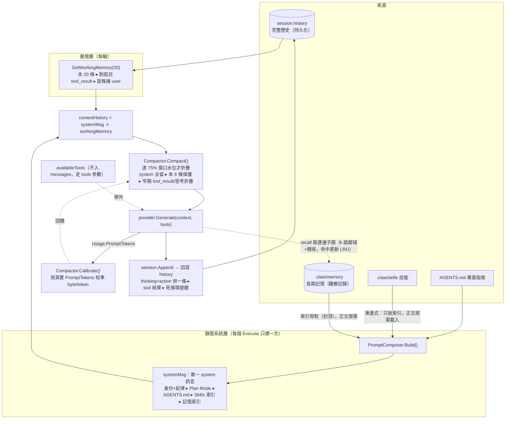

<p align="center">
  
</p>

# cogito-agent

> 一個用 Go 實現的極簡 AI 編程 Agent —— 接入 Slack / Telegram，由 Claude 驅動，能夠自主"思考 → 調用工具 → 觀察結果"循環，在指定工作區內讀寫文件、執行命令來完成編程任務。

`cogito-agent` 是一個輕量級的自主智能體（Agent）框架。它把一個由 Anthropic Claude 驅動的 Agent 引擎接入 Slack / Telegram：你 @機器人或私聊它，它就會在鎖定的工作目錄內自主執行任務，並把思考過程、工具調用和結果實時回推到會話中。

你可以把它當成一名**進駐團隊的數字員工**：常駐你的 IM、記得你們聊過的事（session 跨重啟持久 + 長期記憶）、做危險操作前會請示（審批）、花了多少錢有帳可查（成本追蹤）；接到複雜任務時，它會派出自己的專家隊——planner、code-reviewer、security-auditor、implementer 等[具名子 agent](#具名子-agentclawagentsmd)——並行分工、審查糾錯，最後整合回報。一個員工，背後一整隊專才。

> 這個專案是什麼、不是什麼，以及它的差異化與發展優先序，見 [POSITIONING.md](POSITIONING.md)。

## Demo


▶ 完整版（有畫質、可暫停）：[docs/brag.mp4](docs/brag.mp4)　—— 危險命令審批攔截 → 成本/trace → 自我進化但需你放行。

## Features

**核心引擎**
- 🤖 **自主 Agent 循環**：Thinking → Action → Observation 的多輪 ReAct，跑到任務完成。
- 🧠 **多 Provider**：統一 `LLMProvider` 接口，預設 Claude，可一鍵切到任何 OpenAI 相容端點（OpenAI / vLLM / Ollama / OpenRouter / Groq…）。

**內置工具**（全在鎖定的工作區內運行）
- `read_file` / `write_file` / `edit_file` / `bash`（30s 逾時、合併 stdout/stderr）四件極簡原語。
- 🧭 **`spawn_subagent`**：把子任務委派給隔離子智能體，上下文隔離、可並行派多路；可綁定技能進子 context。支援**具名 agent**（`agent_type`）——在 `.claw/agents/<name>.md` 用 frontmatter 定義角色/工具集（code-reviewer、planner、security-auditor…），不指定則為預設探路者。
- ⏱️ **背景任務**：長命令（dev server、長建置/訓練）丟背景跑、跨輪查輸出/終止；每會話獨立、有並發上限、走同一危險審批。
- 🔌 **可插拔註冊表 + 環繞式中間件**：實現 `BaseTool` 即註冊，中間件掛審批 / 計時等。

**駕馭工程（失控控制）**
- 🔒 **入口授權（fail-closed）**：Slack/Telegram 只有 `COGITO_ALLOWED_USERS` 名單內的 user id 能驅動 agent；不設＝拒絕所有人。高危審批限 `COGITO_ADMIN_USERS`，杜絕「發起者自我放行」。**上線前務必設白名單**（見 [.env.example](.env.example)）——bot 入口 + 工具執行不設限＝未授權者可 RCE。
- 🛡️ **危險指令人工審批（HITL）**：命中黑名單（`rm -rf` / `sudo` / `kill`…）的調用掛起，推回 Slack 等 `approve` / `reject` 才放行（僅管理員）。檔案工具（read/write/edit）在工具層硬擋逃出工作區的 `..` 穿越，不依賴審批。
- 📦 **可插拔沙箱（OS 級硬隔離）**：`bash` 可改用 Docker 執行器，每會話一容器、只掛該會話目錄、`--network none` 斷網、限記憶體/CPU/PID。
- 🚦 **三道硬防線**：回合上限、死循環指紋探測、per-task 成本熔斷。
- ⚡ **工具併發限流** ＋ 🩹 **錯誤自愈**：報錯時注入「下一步怎麼做」的救援指南。

**上下文工程**
- 🗜️ **自適應壓縮**：壓縮水位按模型真實上下文窗口設定，並用每次回傳的 `PromptTokens` 自校準。
- 🪟 **滑動窗口 + System Prompt 組裝**：組裝身份/紀律/`AGENTS.md`/技能；支持 **Plan Mode**（狀態外部化到 `PLAN.md` / `TODO.md`、可斷點續傳）與**漸進式技能載入**（只放索引、正文按需載入）。
- 🧠 **可檢索長期記憶（知識圖譜）**：記憶存成離散記錄、System Prompt 只常駐索引（封頂）；`recall` 回**連通子圖**——命中記憶 + 其 `[[連結]]` 鄰域 + 它們之間的關係（中文 bigram 選種子、k 跳擴張），讓模型做多跳關係推理。命中更新 LRU、超量自動歸檔（可復原非刪除）。取代「`AGENTS.md` 整檔全載」，對齊 CoALA 長期語意層。
- 💾 **Session 持久化（可選）**：對話歷史/費用落地磁碟，重啟後按 ID 復原。
- 🧬 **自我進化（可選，預設關閉）**：成功的流程反思成可複用技能、成敗的經驗反思成專案記憶與調參提案——但**一律只寫進暫存區、不自動生效**，須過確定性把關（結構 + 危險指令/憑證掃描）並經人工放行才晉升。

**接入與可觀測性**
- 💬 **多平台集成（Slack + Telegram）**：傳輸無關核心（`internal/chatbot`）＋薄傳輸層；Slack 走 **Socket Mode**、Telegram 走 **getUpdates 長輪詢**——兩者皆 outbound、**免公開 URL / ngrok**。可同進程同時跑，會話/工作目錄靠 `platform:` 前綴命名空間天然隔離；每頻道工作區隔離 + per-WorkDir 鎖（同目錄序列化、不同頻道並行）。
  - **定址行為兩邊語意一致**：私聊/DM 每則都當任務；頻道/群組只在 **@機器人**（或 Telegram 裡回覆機器人）時才觸發，並自動剝掉 @
- 🔗 **DM 跨平台連續性**（`COGITO_USER_LINK`）：宣告同一人的各平台 id 後，Telegram 私聊問到一半換 Slack 接著問，同一份 session 歷史；回覆送到最後說話的平台提及留乾淨指令。差別僅在機制——Slack 由 Events API 事件類型（`app_mention` / `message.im`）天然區分；Telegram 無此區分，故由傳輸層自行判斷「有沒有叫到我」。
- 📡 **實時進度回推** ＋ 💰 **成本追蹤**：思考 / 工具 / 成敗 / 最終回答實時推到聊天平台（Slack / Telegram），並按會話累計 token 與 USD。
- 🔭 **OpenTelemetry 鏈路追蹤**：OTLP → Jaeger / Langfuse / Collector，LLM span 帶 `gen_ai.*`；未配置端點時零成本 no-op。
- 🧩 **MCP 集成（stdio + Streamable HTTP）**：載入 `.mcp.json` 接外部 MCP 工具伺服器（本地 stdio 或遠端 HTTP，如 Twinkle Hub）；經 gateway 漸進式暴露，不把 N 個完整 schema 塞進每輪 context。

## Architecture

> 各設計維度的取捨、scoped 決定與對照主流 agent（Claude Code / Codex / Hermes），見 [DESIGN.md](DESIGN.md)；競品定位見 [POSITIONING.md](POSITIONING.md)。


### 上下文工程：一輪 prompt 怎麼組起來的

每次發 LLM 前，context 層把 prompt 組成 **靜態系統層 + 動態滑動窗口**，過三道防線後送出；工具 schema 走帶外通道；回應寫回 history 供下一輪。



- **靜態層**（[composer.go](internal/context/composer.go)）：身份/紀律寫死，疊上 Plan Mode、`AGENTS.md`、Skills 索引、記憶索引（皆漸進式，只放目錄不放正文）——整個 Execute 只建一次。
- **長期記憶**（[memory.go](internal/context/memory.go)）：離散記錄存 `.claw/memory/`，索引常駐封頂、`recall` 工具按需取正文（中文 bigram）；命中更新 LRU、超量歸檔到 `.claw/memory-archive/`（可復原）。取代「`AGENTS.md` 整檔全載」。
- **動態層**（[session.go](internal/context/session.go) `GetWorkingMemory`）：取末 20 條，剝孤兒 `tool_result`、首條補 `user` 以滿足 Anthropic 嚴格交替。
- **三道防線**：Compactor 防總量（[75% 水位](internal/context/compactor.go)）、滑動窗口防條數、剝離/補位防協議；皆只動發出去的副本，不毀 `history`。
- **自校準回饋**：每輪用真實 `PromptTokens` 修正 byte/token 比，估算隨 tokenizer 收斂，自動適配不同窗口的模型。

目錄結構：

```
cmd/
├── claw/                 服務端入口（生產用）：裝配 Provider/Registry/Engine + OTel，啟動 Slack Socket Mode（＋設了 token 則同時跑 Telegram 長輪詢）
├── claw-cli/             通用命令行入口（-prompt / -dir / -session / -plan）
├── bench/                自動化評測 runner（-out JSON 報告、-min-pass-rate CI 門檻、-swebench SWE-bench、-dry-run）
├── dashboard/            跑分結果視覺化（Go 服務自包含 HTML，讀 bench JSON 報告）
├── skillgate/            提案技能把關/晉升（安全閘：結構+危險黑名單，過了才生效）
├── ingest/               把 markdown 目錄結構式 ingest 成知識圖譜節點+邊（-src/-root，確定性不花錢）
└── claw-demo-*/          各能力的自包含演示（session / oom / subagent / observability / trace）
internal/
├── engine/                  Agent 核心引擎
│   ├── loop.go              主循環 + RunSub（子智能體）；回合/成本熔斷、併發限流、死循環探測接線
│   ├── reminder.go          死循環探測（指紋參數正規化 + 同工具雙閾值）
│   ├── reporter.go          進度上報接口 Reporter
│   ├── terminal_reporter.go 終端 Reporter
│   └── context.go           把 session 注入 ctx（供中間件取觸發頻道）
├── context/                 上下文工程
│   ├── composer.go          System Prompt 組裝（身份/紀律/Plan Mode/AGENTS.md/Skills）
│   ├── skill.go             .claw/skills 技能漸進式載入（LoadIndex 索引 / ReadSkill 正文）
│   ├── memory.go            可檢索長期記憶（LoadIndex 索引封頂 / Recall 關鍵字檢索 / LRU + 歸檔遺忘）
│   ├── compactor.go         自適應上下文壓縮（按真實窗口 + PromptTokens 自校準）
│   ├── recovery.go          工具錯誤自愈（救援指南注入）
│   ├── session.go           會話歷史 + 滑動窗口 + 成本記帳（store 非 nil 時 write-through 持久化）
│   └── session_store.go     SessionStore / FileSessionStore（一 session 一 JSON、原子寫、跨重啟復原）
├── provider/                大模型 Provider 抽象
│   ├── interface.go         LLMProvider（Generate + MaxContextTokens + ModelName）
│   ├── factory.go           FromEnv 依 COGITO_PROVIDER 選 provider
│   ├── claude.go            Anthropic Claude 實現
│   └── openai.go            OpenAI 相容實現（可配 BaseURL：vLLM/Ollama/OpenRouter…）
├── tools/                   工具集、註冊表與中間件
│   ├── registry.go          註冊 / 發現 / 執行 + 環繞式中間件鏈
│   ├── middleware.go        計時中間件（量測工具物理執行耗時）
│   ├── read_file/write_file/edit_file/bash.go   內置工具
│   ├── subagent.go          spawn_subagent（agent-as-tool）
│   └── task.go / task_tools.go  背景任務（TaskManager + bash_background/task_output/task_kill/task_list）
├── sandbox/                 bash 執行器抽象：HostExecutor（宿主機）/ DockerExecutor（容器硬隔離）
├── mcp/                     MCP 客戶端（stdio + Streamable HTTP 兩種 transport）+ gateway（漸進式暴露）
├── chatbot/                 傳輸無關核心：指令閘/會話隔離/鎖/跑任務管線/進度回報 + HITL 審批 + 跨平台發送路由
│   ├── core.go              Dispatch / handleAgentRun / 命名空間 / reporter
│   └── approval.go          危險指令 HITL 審批（channel-based 單例）
├── slackbot/                Slack 傳輸層：Socket Mode（outbound websocket，免公開 URL）+ @提及剝離 → core.Dispatch
├── telegrambot/             Telegram 傳輸層：getUpdates 長輪詢（免公開 URL）→ core.Dispatch（DM 全收；群組 @我/回覆我 才觸發、自動剝 @提及）
├── cmdutil/                 各 cmd 入口共用啟動樣板（Bootstrap：載入 .env + 初始化 OTel + 回傳 flush）
├── observability/           可觀測性
│   ├── trace.go / tracing.go  OTel 鏈路追蹤（OTLP → Jaeger/Langfuse）
│   └── tracker.go           CostTracker（USD 成本記帳裝飾器）
├── eval/                    評測框架（benchmark）：三段式 TestCase / RunSuite / Reflexion / swebench.go（SWE-bench 接入）
├── evolve/                  自我進化：SkillSynthesizer 技能自生成（寫提案技能、不自動啟用）
└── schema/                 消息與工具的通用數據結構
```

## Install

從源碼構建：

```bash
git clone https://github.com/SIMPLYBOYS/cogito-agent.git
cd cogito-agent
go build ./...
```

需要 **Go 1.25 或更高版本**。

## Configuration

複製環境變量模板並填入真實值（`.env` 已被 `.gitignore` 忽略，不會被提交）：

```bash
cp .env.example .env
```

需要配置的變量：

| 變量 | 說明 |
|------|------|
| `ANTHROPIC_API_KEY` | Anthropic 官方 API 金鑰，從 <https://console.anthropic.com> 獲取 |
| `SLACK_BOT_TOKEN` | Slack Bot Token（`xoxb-` 開頭），所需 Scopes：`chat:write`、`app_mentions:read`、`im:history` |
| `SLACK_APP_TOKEN` | Slack App-Level Token（`xapp-` 開頭，scope `connections:write`），啟用 Socket Mode 後取得；走 outbound websocket 免公開 URL |
| `TELEGRAM_BOT_TOKEN` | （選填，多平台）Telegram Bot Token，向 @BotFather 申請；設了就與 Slack 同進程跑 getUpdates 長輪詢 |
| `COGITO_ALLOWED_USERS` | **（服務端務必設）** 可驅動 agent 的 user id 白名單（逗號分隔）。不設＝fail-closed 拒絕所有入站。Telegram＝數字 id、Slack＝`U` 開頭 |
| `COGITO_ADMIN_USERS` | （選填）可 `approve`/`reject` 高危操作者（逗號分隔）；不設＝回退為 `COGITO_ALLOWED_USERS`。設它以做到「發起者≠批准者」 |
| `COGITO_USER_LINK` | （選填）**DM 跨平台連續性**：宣告同一人在各平台的 user id（`=` 連接一組、逗號分隔多組，如 `771163423=U0AABBCC`）。設了之後這個人在 Telegram / Slack 的**私聊**共用同一份對話狀態（session/工作目錄/忙碌鎖）——Telegram 問到一半換 Slack 接著問，歷史都在；回覆與審批通知送到最後說話的平台。群組不合併（頻道 context 屬於頻道）。必須顯式配置——這是信任宣告，系統不猜 |
| `COGITO_PRICE_INPUT_USD` / `COGITO_PRICE_OUTPUT_USD` | （選填）未登記模型的 fallback 估價（美元/百萬 token），讓成本熔斷對非 Claude 端點仍生效；不設＝opus 級 5/25 |
| `OTEL_EXPORTER_OTLP_ENDPOINT` | （選填）OTLP 鏈路追蹤上報端點，指向 Jaeger / Langfuse / OTel Collector；未設則追蹤為 no-op |
| `OTEL_EXPORTER_OTLP_HEADERS` | （選填）OTLP 認證標頭，如 Langfuse 的 `Authorization=Basic <base64(pk:sk)>` |
| `OTEL_TRACES_EXPORTER` | （選填）設為 `console` 時把 span 印到終端（本地除錯，不需後端） |
| `COGITO_MCP_CONFIG` | （選填）`.mcp.json` 路徑；載入並連接外部 MCP 工具伺服器 |

### MCP 工具伺服器（選填）

設定 `COGITO_MCP_CONFIG` 指向一份 `.mcp.json`（格式與 Claude Desktop 同構），啟動時會連接其中的 stdio MCP 伺服器，把它們的工具以 `<server>__<tool>` 之名註冊進來：

```jsonc
{
  "mcpServers": {
    "filesystem": {
      "command": "npx",
      "args": ["-y", "@modelcontextprotocol/server-filesystem", "/some/dir"]
    }
  }
}
```

```bash
export COGITO_MCP_CONFIG=./.mcp.json
go run ./cmd/claw   # 啟動日誌會顯示「[mcp] 已掛載 server "filesystem" 的 N 個工具」
```

> **無頭瀏覽器**：cogito-agent 沒有原生瀏覽器工具，但掛上 [Playwright MCP](https://github.com/microsoft/playwright-mcp)（`@playwright/mcp --headless`，見 `.mcp.json.example`）即獲得導航 / 點擊 / 抓取 / 截圖等能力，工具以 `playwright__*` 註冊。

## Usage

1. 配置好 `.env` 後，啟動服務：

   ```bash
   go run ./cmd/claw
   ```

   Slack 走 **Socket Mode**、Telegram 走 **getUpdates 長輪詢**——兩者都是 outbound 連線，**不開對外端口、不需要公開 URL／ngrok**。

2. 在 Slack App 後臺啟用 **Socket Mode**（Settings → Socket Mode → Enable），產生一個 App-Level Token（`xapp-` 開頭，scope `connections:write`），填入 `SLACK_APP_TOKEN`；並在 **Event Subscriptions** 訂閱 `app_mention`、`message.im` 事件（Socket Mode 下無需填 Request URL）。

3. 在 Slack 中與機器人交互：
   - 在頻道中 **@機器人** 並描述任務；
   - 或直接給機器人發 **私聊（DM）** 消息。

   除了任務，機器人也聽以下**內建口令**（即「失控控制 / 自我進化」的人工閘，皆會回覆確認；不佔用任務鎖）。**在聊天裡打 `help`（或 `指令`/`commands`）即顯示此清單**：

   | 口令 | 作用 |
   |---|---|
   | `help` / `指令` / `commands` | 顯示指令一覽 |
   | `goal <驗收標準>` | 設一個持久目標，agent 每輪完成後用 LLM judge 驗收、未達成自動續跑（封頂 5 次；受成本熔斷/回合上限保護）。`goal status`/`pause`/`resume`/`clear` 管理 |
   | `stop` | 中止本頻道正在執行的任務（讓執行中的 Run 可取消） |
   | `status` | 顯示本會話花費 / token / 歷史長度 / 模型 / Plan / 忙碌狀態 |
   | `model` / `model <id>` / `model reset` | 查看 / 切換本頻道模型（`reset` 還原啟動預設） |
   | `stop` | 中止本頻道正在執行的任務（可取消 context，回合邊界即時停下） |
   | `status` | 顯示本會話花費 / token / 歷史長度 / 模型 / Plan / 忙碌狀態 |
   | `model` / `model <id>` / `model reset` | 查看 / 切換 / 還原本頻道模型（per-channel，經 `Configurable` provider；下個任務生效） |
   | `compress` | 手動摺疊 context（把舊訊息摺進滾動摘要），縮短歷史省成本 |
   | `learn` | 從本次對話蒸餾一個【提案】技能（進暫存區，過 `skillgate` 把關才生效） |
   | `approve` / `reject`（可帶 taskID） | 放行 / 拒絕被危險指令審批攔下的工具調用（僅 `COGITO_ADMIN_USERS`） |
   | `apply memory` / `reject memory` | 放行 / 丟棄任務後反思出的**提案記憶**（放行＝存成可檢索的長期記憶記錄） |
   | `apply edges` / `reject edges` | 放行 / 丟棄 LLM 抽出的**提案 KG 關係**（放行＝過 gate 併入知識圖譜，下次 `recall` 生效） |
   | `apply config` / `reject config` | 放行 / 丟棄 `cmd/bench -tune` 產出的**提案參數**（放行＝晉升為 `.claw/config.json`、下次任務起套用；套用時再 clamp 有界） |
   | `plan on` / `plan off` / `plan status` | 切換**本頻道** Plan Mode（計畫外部化到 `PLAN.md`/`TODO.md` + 目標錨 + 確定性步驟跳過）。多步長任務建議開、閒聊免儀式；狀態隨 session 持久化 |

   （`apply memory` / `apply edges` 需啟用對應的 `COGITO_*_SYNTH`；提案產生時機器人會主動通知。Plan Mode 為 per-channel、預設關。其餘能力用**自然語言**交辦：讀寫檔、bash、`recall` 長期記憶、派子 agent、畫長條圖、呼叫 MCP 工具…）

   **CLI（`cmd/claw-cli`）旗標**：

   | 旗標 | 預設 | 作用 |
   |---|---|---|
   | `-prompt` | （必填） | 交辦的任務；留空印用法並退出 |
   | `-dir` | `./workspace` | 工作區目錄（子 agent 的 worktree 隔離需此為 git repo） |
   | `-session` | `cli-session` | 會話 ID，配 `COGITO_SESSION_DIR` 可斷點續傳 |
   | `-plan` | `false` | 開 Plan Mode |
   | `-verify` | — | goal 循環：驗證 bash 指令（退出碼 0 = 達成），設了就跑到通過或用盡 |
   | `-verify-judge` | — | goal 循環：用 LLM 依【自然語言標準】驗收（給寫文件/設計等 bash 難驗的任務）；與 `-verify` 二擇一 |
   | `-max-attempts` | `5` | goal 循環最大嘗試次數 |

機器人在工作區根目錄 `./workspace/` 下、**每個頻道各自隔離的子目錄** `channels/<頻道ID>/` 內完成任務（同頻道任務序列化、不同頻道並行）；技能與 `AGENTS.md` 則從根 `workspace/` 共享讀取。進度實時回覆到對應會話。

> ⚠️ **安全提示**：預設（`HostExecutor`）下 `bash` 會在服務所在機器上執行任意命令，`write_file` / `edit_file` 會修改文件——請僅在隔離/受控環境中運行。**生產建議啟用 Docker 沙箱**取得 OS 級硬邊界：
>
> ```bash
> docker build -t cogito-sandbox:latest -f docker/sandbox.Dockerfile .
> export COGITO_SANDBOX=docker     # bash 命令改在隔離容器內執行
> # 可調：COGITO_SANDBOX_IMAGE / _MEMORY（512m）/ _CPUS（1.0）/ _NETWORK（none）/ _PIDS（256）
> ```
>
> 啟用後**每個 session 維持一個常駐容器**：首次 bash 呼叫時 `docker run -d ... sleep infinity` 拉起、之後都 `docker exec` 進去——省去每命令的容器啟動延遲，且容器內**安裝的套件 / 寫入的檔案 / 背景進程**在同 session 多次呼叫間持久保留。容器只掛入該 session 的 workDir、預設斷網、限資源；服務優雅關閉（或 CLI 退出）時自動 `docker rm -f` 清掉。容器名由 workDir 雜湊決定，崩潰重啟後可辨識並清理。
>
> 持久的是**檔案系統層**的狀態（套件/檔案/進程）；**不含** shell 的 `export` 環境變數、`cd`、別名——因為每條 bash 是一條獨立的 `docker exec ... bash -c`，那是全新進程（與 host 模式「每次新 shell」一致）。要持久環境變數請寫進 `~/.bashrc` 等檔案。
>
> 注意：首次啟動容器若需拉映像會較慢（建議先 `docker build` 好本地映像）；目前一個 session 對應一個容器、不對單條命令再做細分。

### Session 持久化（跨重啟續傳）

```bash
export COGITO_SESSION_DIR=./workspace/sessions   # 設了才落地磁碟；未設＝純記憶體
go run ./cmd/claw-cli -session task_001 -prompt "開始一個多步驟任務"
# 重啟後同一 -session 接著跑，歷史與費用都還在：
go run ./cmd/claw-cli -session task_001 -prompt "繼續"
```

對 Slack（`cmd/claw`）同理：設 `COGITO_SESSION_DIR` 後各頻道記憶不因服務重啟而丟失。每個 session 一個 JSON 檔（含對話歷史），請勿入庫（已加進 `.gitignore`）。

## Development

```bash
go test ./...      # 運行測試
go vet ./...       # 靜態檢查
go build ./...     # 構建
```

### 評測（eval）與儀表板

```bash
# 1) 跑分（真實 API、需 ANTHROPIC_API_KEY）並輸出 JSON 報告
go run ./cmd/bench -model claude-haiku-4-5 -out ./bench-reports
# CI 門檻：通過率低於 0.8 即以非 0 退出碼結束 → 讓 CI job 失敗
go run ./cmd/bench -out ./bench-reports -min-pass-rate 0.8
# Reflexion：失敗的用例反思出教訓、最多重試 3 次（每次重試多花 API）
go run ./cmd/bench -reflexion 3 -out ./bench-reports
# 參數自調：依跑分指標產出調參提案（→ workspace/.claw/config.proposed.json，不自動套用）
go run ./cmd/bench -tune -out ./bench-reports

# 2) 視覺化：讀報告目錄、開儀表板（成功率 / 逐用例回合·試錯·成本·耗時 / 歷次趨勢）
go run ./cmd/dashboard -dir ./bench-reports   # → http://localhost:8090
```

### SWE-bench（公認 agentic coding benchmark）

同一套評測框架可直接跑 [SWE-bench](https://www.swebench.com/)：每個實例是一個真實 GitHub issue → 修補。loader 把實例映射到既有三段式 `TestCase`，**評測方法論對齊官方、且防作弊**：

| 階段 | 對應 | 防作弊關鍵 |
|---|---|---|
| **Setup** | `clone` 到 `base_commit`，**不含** `test_patch` | agent 解題時看不到驗證測試 |
| **Task** | 只給 `problem_statement`（issue） | 黃金 `patch` / 測試**不進** prompt，無從照抄 |
| **Validate** | **跑完才** `git apply test_patch` → 跑 `FAIL_TO_PASS`(+`PASS_TO_PASS`) | 測試在 agent 之後才套，改不到 |

```bash
# 離線 dry-run：印出每個實例的 Setup/Task/Validate 計畫——不呼叫 LLM、不 clone、不花錢
go run ./cmd/bench -swebench path/to/swe.jsonl -limit 5 -dry-run

# 真跑（需 ANTHROPIC_API_KEY；會 clone repo + 跑測試，逐題計成本）
go run ./cmd/bench -swebench path/to/swe.jsonl -limit 5 -out ./bench-reports
```

> 各 repo 的 Python 環境差異大，正式跑建議在官方 SWE-bench Docker 映像內執行（依賴已備）；`-swe-env-setup '<bash>'` 可覆蓋每個實例的環境安裝步驟。agent 只用 `read_file`/`write_file`/`edit_file`/`bash` 解題（無 SWE-bench 專用工具）。

### Plan Mode（長程任務斷點續傳）

長任務最大的敵人不是「不會規劃」，而是**上下文流失**（窗口壓縮、滑動窗口、進程重啟、被防線中斷）。Plan Mode 用**狀態外部化**對抗它：強制把計畫寫 `PLAN.md`、進度寫 `TODO.md`、做一步打勾一步；喚醒時先嗅探這兩個檔，從第一個未打勾項續跑。

```bash
go run ./cmd/claw-cli -plan -dir ./workspace/proj -prompt "<多步驟長任務>"
```

**實證（haiku）**：一個「依序建 6 檔」的任務，跑到第 4 步時用 SIGTERM 強制中斷 → 磁碟留下 `s1–s4` + `TODO.md` 前 4 項 `[x]`。**重啟一個全新進程（in-memory session 為空、零對話記憶）只說「繼續」** → agent 嗅探到 `PLAN.md`/`TODO.md`、讀出「已到第 4 步」、**只補做 s5/s6**（零重工）。計畫若只存在模型的 context 裡，重啟那刻就沒了；檔案化的計畫活了下來——**這個價值與模型多強無關**。預設關閉、`-plan` opt-in（短任務不需要）。

### Loop Engineering（goal 循環 + 心跳）

```bash
# goal 循環：跑到 bash 驗證通過為止（退出碼 0 = 達成）。verify 輸出當下一輪反饋，自動重試。
go run ./cmd/claw-cli -session fix-bug \
  -prompt "修好 ./app 的編譯錯誤" \
  -verify "cd ./app && go build ./..." -max-attempts 5

# 心跳：不在 app 內造排程器——OS 的 cron 就是心跳。一行 crontab 每早 8 點跑（-session 持久化＝跨次累積的「脊柱」）：
# 0 8 * * 1-5  cd /path/to/cogito-agent && COGITO_SESSION_DIR=./workspace/sessions ./claw-cli -session daily-triage -prompt "拉昨日 CI 失敗，挑出可修的，逐一處理"

# 定期覆盤：每週一早上審閱近 7 天互動，蒸餾技能/慣例提案（retrospect 技能＝覆盤 playbook，
# 產物只進 skills-proposed/ 與 AGENTS.proposed.md 提案通道，人工放行才生效）：
# 0 8 * * 1  cd /path/to/cogito-agent && COGITO_SESSION_DIR=./workspace/sessions ./claw-cli -session retrospect -prompt "用 read_skill 讀 retrospect 技能，照著覆盤近 7 天"
```

### 切換 LLM Provider

```bash
# 預設 Claude（需 ANTHROPIC_API_KEY；可選 CLAUDE_MODEL）
go run ./cmd/claw-cli -prompt "..."

# OpenAI 或任何 OpenAI 相容端點（本地 vLLM / Ollama / OpenRouter / Groq…）
export COGITO_PROVIDER=openai
export OPENAI_API_KEY=sk-...
export OPENAI_BASE_URL=https://api.openai.com/v1   # 或 http://localhost:8000/v1 等
export OPENAI_MODEL=gpt-4o-mini
go run ./cmd/claw-cli -prompt "..."
```

### 具名子 agent（`.claw/agents/*.md`）

把「單一探路者」擴成一組專才：在 `<workspace>/.claw/agents/<name>.md` 用 frontmatter 定義角色，主 agent 呼叫 `spawn_subagent` 時帶 `agent_type` 即可派出。複用同一套隔離委派 + 能力沙箱機制，可並行派多路。

這就是導言說的「數字員工背後的專家隊」：員工只有一個（進駐 IM 的主 agent），專才是它按需派遣的臨時編組——角色**定義**持久（本目錄的 `.md`），**實例**用完即棄、記憶外部化（工作區檔案 / 技能 / `.claw/memory`），不留常駐狀態，每次派遣都乾淨可重現。

```markdown
---
name: code-reviewer
description: 從正確性/安全/可讀性審查程式碼變更，只讀不改
tools: [read_file, bash]        # 可選；限縮到子 agent 工具集的子集，省略＝沿用預設探索工具
model: claude-opus-4-8          # 可選；該 agent 用的模型（省略＝沿用主引擎模型）
effort: high                    # 可選；low/medium/high → 輸出 token 上限 2048/4096/8192
isolation: worktree             # 可選；在 git worktree 隔離執行，完事把 diff apply 回主工作區
---
你是資深 code reviewer。用 read_file 與 bash 閱讀變更，從正確性/安全/可讀性審查。
每個問題給 file:line + 一句話問題 + 最小修法；沒問題就說「無明顯問題」。完成後輸出精煉報告。
```

- `agent_type` 未指定 → 預設探路者（**唯讀** `read_file`+`bash`），行為與過去一致。
- **可寫的實作型 agent**：在 `tools` 明確宣告 `write_file` / `edit_file`，該 agent 就能改檔（如上例 `implementer`）。寫入是 **opt-in**——沒宣告就拿不到，且照走審批 middleware（敏感寫入 `.env`/`.git`/絕對路徑仍需人工放行）、檔案工具在工具層硬擋逃出工作區。
- `tools` 只能是子 agent 工具超集（`read_file`/`bash`/`write_file`/`edit_file`）的子集，不含 `spawn_subagent`（杜絕遞迴）。
- 可用清單會自動列進 `spawn_subagent` 的工具說明，讓模型知道有哪些角色可派。
- **選模型 / effort**：`model` 讓探路用便宜快的（haiku）、審查用強的（opus）分層；`effort` 調輸出深度（token 上限）。provider 支援才生效，成本仍記進同一 session。effort 是輸出上限的粗略代理，非 extended-thinking。
- **worktree 隔離**（`isolation: worktree`）：可寫 agent 在 base 的 git worktree 隔離跑，完事把 diff **序列化 apply 回主工作區**——這樣一輪並行多個可寫 agent 也不會相互覆蓋（各寫各的 worktree，回寫一個一個來）。前提：workspace 是 git repo（否則自動降級為共享工作區）、host 執行模式（docker sandbox 下 bash 掛在 base 容器，與 worktree 檔案隔離不完全對齊）。回寫衝突時，diff 會附在子 agent 報告裡交主 agent 處理。
- **背景/非同步委派**（`background: true`）：丟背景池非同步跑、立即回一個 ID（如 `bg-1`），主 agent 可先繼續、之後用 `subagent_result`（帶 id）取結果、`subagent_list` 看全部。per-session 池、有並發上限與保留式清理（對齊背景 bash 的 TaskManager）。背景模式在**共享工作區** silent 跑（不做 worktree 隔離）；要並行隔離寫入請用同步的 `isolation: worktree`。

#### 編排模式（Orchestrator）——model-driven、零框架碼

「主 agent 規劃 → 分派子 agent（並行/串行）→ 審查 → 糾錯 → 整合」這種 orchestration**就是 ReAct**：主 agent 的「行動」是 `spawn_subagent`、子 agent 的報告是「觀察」，據此迭代到達成。cogito **不需要 workflow DAG 引擎**（那是 framework-driven、偏離 ReAct）；要讓主 agent 可靠地進入這個模式，寫一個 **`orchestrate` 技能**（`.claw/skills/orchestrate/SKILL.md`，內容是編排 playbook）即可——主 agent 碰到複雜任務時 `read_skill` 讀它、照著把 `implementer`/`code-reviewer` 等具名 agent 編排起來。**純 prompt、零引擎改動、與 per-agent 選模型和 worktree 隔離自然疊加**（例如 orchestrator 用大模型、worker 用小模型）。

### 跑多個員工（多實例，零代碼）

導言說 cogito 是「一名數字員工」——要一個團隊，就**每個員工一個目錄**。`claw` 從當前目錄載 `.env`、工作區固定在 `<當前目錄>/workspace`，所以一個目錄就是一個完整隔離的員工：自己的 IM 身分（bot token）、自己的人格與技能庫（`workspace/.claw/`）、自己的記憶與會話（`COGITO_SESSION_DIR`）、自己的白名單與模型設定。

```bash
go install ./cmd/claw          # binary 裝一次（$GOBIN），到處可用

# 員工一：coder（自己的 Telegram bot、opus、可寫的實作型 agents）
mkdir -p ~/agents/coder && cd ~/agents/coder
cp /path/to/cogito-agent/.env.example .env   # 填「這個員工自己的」bot token / 白名單 / 模型
mkdir -p workspace/.claw/{agents,skills}      # 這個員工的角色與技能庫
claw                                          # coder 上工（.env 與 workspace 都取自當前目錄）

# 員工二：reviewer（另一個 bot token、唯讀工具集）——另開目錄、另起 process，互不相識
cd ~/agents/reviewer && claw
```

- **隔離即邊界**：員工間技能/記憶/會話完全不共享——coder 學會的東西 reviewer 不會。要共享，顯式共享（見下）。
- **「聘僱」一個預訓員工**：`workspace/.claw/`（agents/skills/memory）全是純文字檔——打包成 git repo 就是可分發的員工檔案，`git clone` 進新目錄＝到職（帶著角色與技能、記憶空白）。**secrets（`.env`）永遠不進 repo。**

```bash
git clone github.com/you/reviewer-claw ~/agents/reviewer/workspace/.claw
```

- 對照：這與 Hermes Agent 的 Profiles（"Running Multiple Agents"）同構——每員工一個 home directory。cogito 不需要專用 profile CLI：**目錄即 profile**。

### 技能自生成 + 把關

```bash
# 1) 開啟自生成（技能 + 專案記憶）：產物只進暫存區、不自動生效
export COGITO_SKILL_SYNTH=1      # 可複用流程 → .claw/skills-proposed/
export COGITO_MEMORY_SYNTH=1     # 耐久專案慣例/雷點 → .claw/AGENTS.proposed.md（review 後併入 AGENTS.md）
go run ./cmd/claw-cli -session t1 -prompt "<會用到某個可複用流程的任務>"

# 2) 把關 review：列出提案技能 + 確定性把關（結構 + 危險指令/憑證黑名單）
go run ./cmd/skillgate

# 3) 晉升：把關通過才移到 .claw/skills/ 生效（危險/不合格者一律被拒）
go run ./cmd/skillgate -promote <技能名>   # 名稱＝skills-proposed/ 下的資料夾名
```

CI：[`.github/workflows/ci.yml`](.github/workflows/ci.yml) 每次 push/PR 跑 gofmt/vet/build/`test -race`（無需 key）；[`benchmark.yml`](.github/workflows/benchmark.yml) 手動或每週排程跑分（需在 repo Secrets 設 `ANTHROPIC_API_KEY`），上傳 JSON 報告為 artifact。

## Contributing

歡迎提交 Issue 與 Pull Request。提交前請先運行 `go test ./...` 和 `go vet ./...`。

## License

基於 [MIT License](LICENSE) 發佈。
