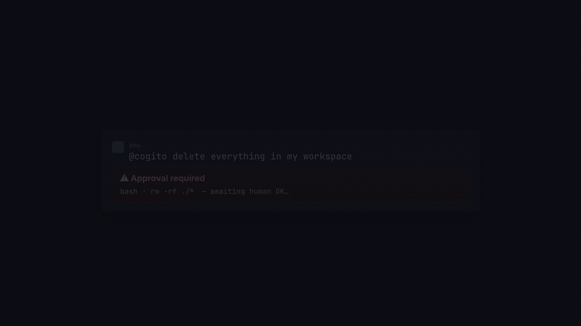
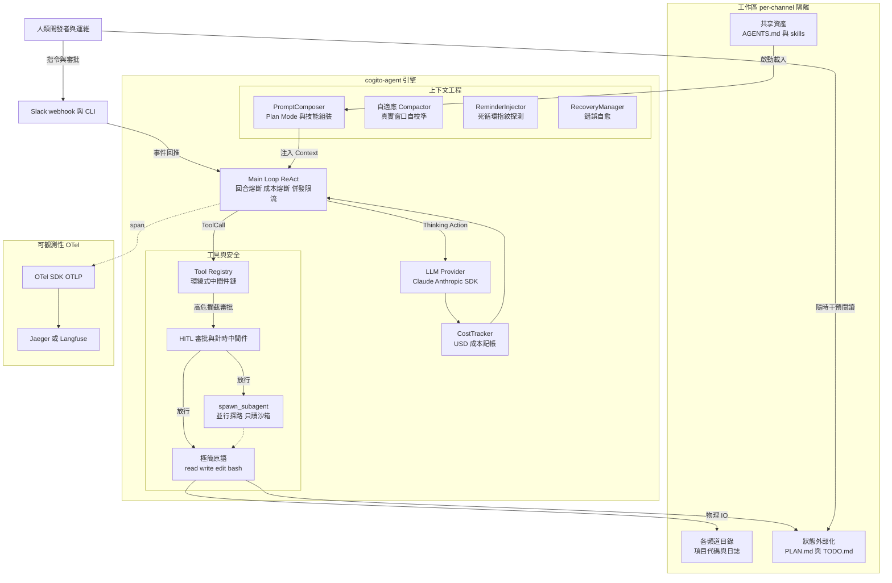
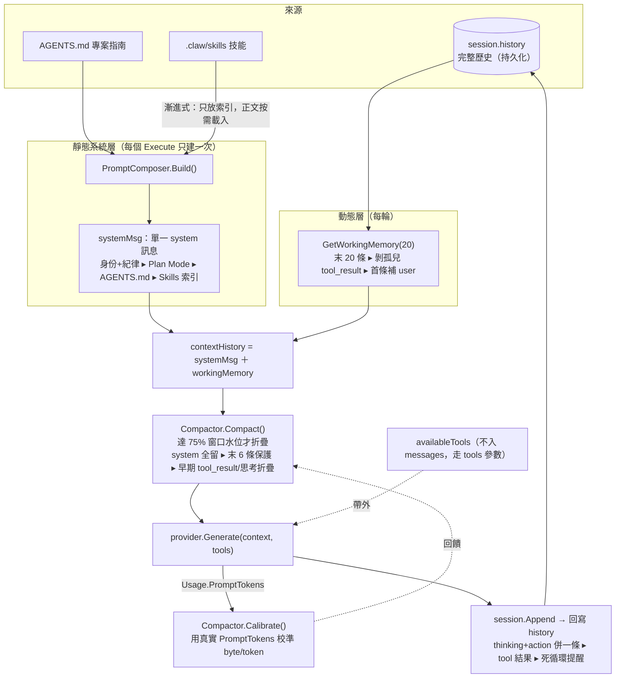

# cogito-agent

> 一個用 Go 實現的極簡 AI 編程 Agent —— 接入 Slack，由 Claude 驅動，能夠自主"思考 → 調用工具 → 觀察結果"循環，在指定工作區內讀寫文件、執行命令來完成編程任務。

`cogito-agent` 是一個輕量級的自主智能體（Agent）框架。它把一個由 Anthropic Claude 驅動的 Agent 引擎接入 Slack：你在 Slack 中 @機器人或私聊它，它就會在鎖定的工作目錄內自主執行任務，並把思考過程、工具調用和結果實時回推到會話中。

> 這個專案是什麼、不是什麼，以及它的差異化與發展優先序，見 [POSITIONING.md](POSITIONING.md)。

## Demo



▶ 完整版（有畫質、可暫停）：[docs/brag.mp4](docs/brag.mp4)　—— 危險命令審批攔截 → 成本/trace → 自我進化但需你放行。

## Features

**核心引擎**
- 🤖 **自主 Agent 循環**：Thinking → Action → Observation 的多輪 ReAct，跑到任務完成。
- 🧠 **多 Provider**：統一 `LLMProvider` 接口，預設 Claude，可一鍵切到任何 OpenAI 相容端點（OpenAI / vLLM / Ollama / OpenRouter / Groq…）。

**內置工具**（全在鎖定的工作區內運行）
- `read_file` / `write_file` / `edit_file` / `bash`（30s 逾時、合併 stdout/stderr）四件極簡原語。
- 🧭 **`spawn_subagent`**：把深度探索委派給只讀子智能體，上下文隔離、可並行派多路；可綁定技能進子 context。
- ⏱️ **背景任務**：長命令（dev server、長建置/訓練）丟背景跑、跨輪查輸出/終止；每會話獨立、有並發上限、走同一危險審批。
- 🔌 **可插拔註冊表 + 環繞式中間件**：實現 `BaseTool` 即註冊，中間件掛審批 / 計時等。

**駕馭工程（失控控制）**
- 🛡️ **危險指令人工審批（HITL）**：命中黑名單（`rm -rf` / `sudo` / `kill`…）的調用掛起，推回 Slack 等 `approve` / `reject` 才放行。
- 📦 **可插拔沙箱（OS 級硬隔離）**：`bash` 可改用 Docker 執行器，每會話一容器、只掛該會話目錄、`--network none` 斷網、限記憶體/CPU/PID。
- 🚦 **三道硬防線**：回合上限、死循環指紋探測、per-task 成本熔斷。
- ⚡ **工具併發限流** ＋ 🩹 **錯誤自愈**：報錯時注入「下一步怎麼做」的救援指南。

**上下文工程**
- 🗜️ **自適應壓縮**：壓縮水位按模型真實上下文窗口設定，並用每次回傳的 `PromptTokens` 自校準。
- 🪟 **滑動窗口 + System Prompt 組裝**：組裝身份/紀律/`AGENTS.md`/技能；支持 **Plan Mode**（狀態外部化到 `PLAN.md` / `TODO.md`、可斷點續傳）與**漸進式技能載入**（只放索引、正文按需載入）。
- 💾 **Session 持久化（可選）**：對話歷史/費用落地磁碟，重啟後按 ID 復原。
- 🧬 **自我進化（可選，預設關閉）**：成功的流程反思成可複用技能、成敗的經驗反思成專案記憶與調參提案——但**一律只寫進暫存區、不自動生效**，須過確定性把關（結構 + 危險指令/憑證掃描）並經人工放行才晉升。

**接入與可觀測性**
- 💬 **Slack 集成**：Events API，支援 @提及 與私聊；每頻道工作區隔離 + per-WorkDir 鎖（同目錄序列化、不同頻道並行）。
- 📡 **實時進度回推** ＋ 💰 **成本追蹤**：思考 / 工具 / 成敗 / 最終回答實時推到 Slack，並按會話累計 token 與 USD。
- 🔭 **OpenTelemetry 鏈路追蹤**：OTLP → Jaeger / Langfuse / Collector，LLM span 帶 `gen_ai.*`；未配置端點時零成本 no-op。
- 🧩 **MCP 集成（stdio + Streamable HTTP）**：載入 `.mcp.json` 接外部 MCP 工具伺服器（本地 stdio 或遠端 HTTP，如 Twinkle Hub）；經 gateway 漸進式暴露，不把 N 個完整 schema 塞進每輪 context。

## Architecture



### 上下文工程：一輪 prompt 怎麼組起來的

每次發 LLM 前，context 層把 prompt 組成 **靜態系統層 + 動態滑動窗口**，過三道防線後送出；工具 schema 走帶外通道；回應寫回 history 供下一輪。



- **靜態層**（[composer.go](internal/context/composer.go)）：身份/紀律寫死，疊上 Plan Mode、`AGENTS.md`、Skills 索引（漸進式，只放目錄不放正文）——整個 Execute 只建一次。
- **動態層**（[session.go](internal/context/session.go) `GetWorkingMemory`）：取末 20 條，剝孤兒 `tool_result`、首條補 `user` 以滿足 Anthropic 嚴格交替。
- **三道防線**：Compactor 防總量（[75% 水位](internal/context/compactor.go)）、滑動窗口防條數、剝離/補位防協議；皆只動發出去的副本，不毀 `history`。
- **自校準回饋**：每輪用真實 `PromptTokens` 修正 byte/token 比，估算隨 tokenizer 收斂，自動適配不同窗口的模型。

目錄結構：

```
cmd/
├── claw/                 Slack 服務端入口（生產用）：裝配 Provider/Registry/Engine/SlackBot + OTel，啟動 HTTP
├── claw-cli/             通用命令行入口（-prompt / -dir / -session / -plan）
├── bench/                自動化評測 runner（-out 輸出 JSON 報告、-min-pass-rate CI 門檻）
├── dashboard/            跑分結果視覺化（Go 服務自包含 HTML，讀 bench JSON 報告）
├── skillgate/            提案技能把關/晉升（安全閘：結構+危險黑名單，過了才生效）
└── claw-demo-*/          各能力的自包含演示（session / oom / subagent / observability / trace）
internal/
├── engine/                  Agent 核心引擎
│   ├── loop.go              主循環 + RunSub（子智能體）；回合/成本熔斷、併發限流、死循環探測接線
│   ├── reminder.go          死循環探測（指紋參數正規化 + 同工具雙閾值）
│   ├── reporter.go          進度上報接口 Reporter
│   ├── terminal_reporter.go 終端 Reporter
│   └── context.go           把 session 注入 ctx（供中間件取觸發頻道）
├── context/                 上下文工程
│   ├── composer.go          System Prompt 組裝（身份/紀律/Plan Mode/AGENTS.md/Skills）
│   ├── skill.go             .claw/skills 技能漸進式載入（LoadIndex 索引 / ReadSkill 正文）
│   ├── compactor.go         自適應上下文壓縮（按真實窗口 + PromptTokens 自校準）
│   ├── recovery.go          工具錯誤自愈（救援指南注入）
│   ├── session.go           會話歷史 + 滑動窗口 + 成本記帳（store 非 nil 時 write-through 持久化）
│   └── session_store.go     SessionStore / FileSessionStore（一 session 一 JSON、原子寫、跨重啟復原）
├── provider/                大模型 Provider 抽象
│   ├── interface.go         LLMProvider（Generate + MaxContextTokens + ModelName）
│   ├── factory.go           FromEnv 依 COGITO_PROVIDER 選 provider
│   ├── claude.go            Anthropic Claude 實現
│   └── openai.go            OpenAI 相容實現（可配 BaseURL：vLLM/Ollama/OpenRouter…）
├── tools/                   工具集、註冊表與中間件
│   ├── registry.go          註冊 / 發現 / 執行 + 環繞式中間件鏈
│   ├── middleware.go        計時中間件（量測工具物理執行耗時）
│   ├── read_file/write_file/edit_file/bash.go   內置工具
│   ├── subagent.go          spawn_subagent（agent-as-tool）
│   └── task.go / task_tools.go  背景任務（TaskManager + bash_background/task_output/task_kill/task_list）
├── sandbox/                 bash 執行器抽象：HostExecutor（宿主機）/ DockerExecutor（容器硬隔離）
├── mcp/                     MCP 客戶端（stdio + Streamable HTTP 兩種 transport）+ gateway（漸進式暴露）
├── slackbot/                Slack 接入層
│   ├── bot.go               Events API 回調、per-channel 工作區隔離與鎖、SlackReporter
│   └── approval.go          危險指令 HITL 審批
├── cmdutil/                 各 cmd 入口共用啟動樣板（Bootstrap：載入 .env + 初始化 OTel + 回傳 flush）
├── observability/           可觀測性
│   ├── trace.go / tracing.go  OTel 鏈路追蹤（OTLP → Jaeger/Langfuse）
│   └── tracker.go           CostTracker（USD 成本記帳裝飾器）
├── eval/                    評測框架（benchmark）
├── evolve/                  自我進化：SkillSynthesizer 技能自生成（寫提案技能、不自動啟用）
└── schema/                 消息與工具的通用數據結構
```

## Install

從源碼構建：

```bash
git clone https://github.com/SIMPLYBOYS/cogito-agent.git
cd cogito-agent
go build ./...
```

需要 **Go 1.25 或更高版本**。

## Configuration

複製環境變量模板並填入真實值（`.env` 已被 `.gitignore` 忽略，不會被提交）：

```bash
cp .env.example .env
```

需要配置的變量：

| 變量 | 說明 |
|------|------|
| `ANTHROPIC_API_KEY` | Anthropic 官方 API 金鑰，從 <https://console.anthropic.com> 獲取 |
| `SLACK_BOT_TOKEN` | Slack Bot Token（`xoxb-` 開頭），所需 Scopes：`chat:write`、`app_mentions:read`、`im:history` |
| `SLACK_SIGNING_SECRET` | Slack Signing Secret，用於校驗回調請求籤名 |
| `OTEL_EXPORTER_OTLP_ENDPOINT` | （選填）OTLP 鏈路追蹤上報端點，指向 Jaeger / Langfuse / OTel Collector；未設則追蹤為 no-op |
| `OTEL_EXPORTER_OTLP_HEADERS` | （選填）OTLP 認證標頭，如 Langfuse 的 `Authorization=Basic <base64(pk:sk)>` |
| `OTEL_TRACES_EXPORTER` | （選填）設為 `console` 時把 span 印到終端（本地除錯，不需後端） |
| `COGITO_MCP_CONFIG` | （選填）`.mcp.json` 路徑；載入並連接外部 MCP 工具伺服器 |

### MCP 工具伺服器（選填）

設定 `COGITO_MCP_CONFIG` 指向一份 `.mcp.json`（格式與 Claude Desktop 同構），啟動時會連接其中的 stdio MCP 伺服器，把它們的工具以 `<server>__<tool>` 之名註冊進來：

```jsonc
{
  "mcpServers": {
    "filesystem": {
      "command": "npx",
      "args": ["-y", "@modelcontextprotocol/server-filesystem", "/some/dir"]
    }
  }
}
```

```bash
export COGITO_MCP_CONFIG=./.mcp.json
go run ./cmd/claw   # 啟動日誌會顯示「[mcp] 已掛載 server "filesystem" 的 N 個工具」
```

> **無頭瀏覽器**：cogito-agent 沒有原生瀏覽器工具，但掛上 [Playwright MCP](https://github.com/microsoft/playwright-mcp)（`@playwright/mcp --headless`，見 `.mcp.json.example`）即獲得導航 / 點擊 / 抓取 / 截圖等能力，工具以 `playwright__*` 註冊。

## Usage

1. 配置好 `.env` 後，啟動服務：

   ```bash
   go run ./cmd/claw
   ```

   服務默認監聽 **48080** 端口，Slack Events 回調入口為 `/webhook/event`。

2. 在 Slack App 後臺的 **Event Subscriptions** 中，將 Request URL 配置為你的公網地址，例如：

   ```
   https://<your-domain>/webhook/event
   ```

   （本地開發可藉助 ngrok 等內網穿透工具暴露 48080 端口。）

3. 在 Slack 中與機器人交互：
   - 在頻道中 **@機器人** 並描述任務；
   - 或直接給機器人發 **私聊（DM）** 消息。

機器人在工作區根目錄 `./workspace/` 下、**每個頻道各自隔離的子目錄** `channels/<頻道ID>/` 內完成任務（同頻道任務序列化、不同頻道並行）；技能與 `AGENTS.md` 則從根 `workspace/` 共享讀取。進度實時回覆到對應會話。

> ⚠️ **安全提示**：預設（`HostExecutor`）下 `bash` 會在服務所在機器上執行任意命令，`write_file` / `edit_file` 會修改文件——請僅在隔離/受控環境中運行。**生產建議啟用 Docker 沙箱**取得 OS 級硬邊界：
>
> ```bash
> docker build -t cogito-sandbox:latest -f docker/sandbox.Dockerfile .
> export COGITO_SANDBOX=docker     # bash 命令改在隔離容器內執行
> # 可調：COGITO_SANDBOX_IMAGE / _MEMORY（512m）/ _CPUS（1.0）/ _NETWORK（none）/ _PIDS（256）
> ```
>
> 啟用後**每個 session 維持一個常駐容器**：首次 bash 呼叫時 `docker run -d ... sleep infinity` 拉起、之後都 `docker exec` 進去——省去每命令的容器啟動延遲，且容器內**安裝的套件 / 寫入的檔案 / 背景進程**在同 session 多次呼叫間持久保留。容器只掛入該 session 的 workDir、預設斷網、限資源；服務優雅關閉（或 CLI 退出）時自動 `docker rm -f` 清掉。容器名由 workDir 雜湊決定，崩潰重啟後可辨識並清理。
>
> 持久的是**檔案系統層**的狀態（套件/檔案/進程）；**不含** shell 的 `export` 環境變數、`cd`、別名——因為每條 bash 是一條獨立的 `docker exec ... bash -c`，那是全新進程（與 host 模式「每次新 shell」一致）。要持久環境變數請寫進 `~/.bashrc` 等檔案。
>
> 注意：首次啟動容器若需拉映像會較慢（建議先 `docker build` 好本地映像）；目前一個 session 對應一個容器、不對單條命令再做細分。

### Session 持久化（跨重啟續傳）

```bash
export COGITO_SESSION_DIR=./workspace/sessions   # 設了才落地磁碟；未設＝純記憶體
go run ./cmd/claw-cli -session task_001 -prompt "開始一個多步驟任務"
# 重啟後同一 -session 接著跑，歷史與費用都還在：
go run ./cmd/claw-cli -session task_001 -prompt "繼續"
```

對 Slack（`cmd/claw`）同理：設 `COGITO_SESSION_DIR` 後各頻道記憶不因服務重啟而丟失。每個 session 一個 JSON 檔（含對話歷史），請勿入庫（已加進 `.gitignore`）。

## Development

```bash
go test ./...      # 運行測試
go vet ./...       # 靜態檢查
go build ./...     # 構建
```

### 評測（eval）與儀表板

```bash
# 1) 跑分（真實 API、需 ANTHROPIC_API_KEY）並輸出 JSON 報告
go run ./cmd/bench -model claude-haiku-4-5 -out ./bench-reports
# CI 門檻：通過率低於 0.8 即以非 0 退出碼結束 → 讓 CI job 失敗
go run ./cmd/bench -out ./bench-reports -min-pass-rate 0.8
# Reflexion：失敗的用例反思出教訓、最多重試 3 次（每次重試多花 API）
go run ./cmd/bench -reflexion 3 -out ./bench-reports
# 參數自調：依跑分指標產出調參提案（→ workspace/.claw/config.proposed.json，不自動套用）
go run ./cmd/bench -tune -out ./bench-reports

# 2) 視覺化：讀報告目錄、開儀表板（成功率 / 逐用例回合·試錯·成本·耗時 / 歷次趨勢）
go run ./cmd/dashboard -dir ./bench-reports   # → http://localhost:8090
```

### Loop Engineering（goal 循環 + 心跳）

```bash
# goal 循環：跑到 bash 驗證通過為止（退出碼 0 = 達成）。verify 輸出當下一輪反饋，自動重試。
go run ./cmd/claw-cli -session fix-bug \
  -prompt "修好 ./app 的編譯錯誤" \
  -verify "cd ./app && go build ./..." -max-attempts 5

# 心跳：不在 app 內造排程器——OS 的 cron 就是心跳。一行 crontab 每早 8 點跑（-session 持久化＝跨次累積的「脊柱」）：
# 0 8 * * 1-5  cd /path/to/cogito-agent && COGITO_SESSION_DIR=./workspace/sessions ./claw-cli -session daily-triage -prompt "拉昨日 CI 失敗，挑出可修的，逐一處理"
```

### 切換 LLM Provider

```bash
# 預設 Claude（需 ANTHROPIC_API_KEY；可選 CLAUDE_MODEL）
go run ./cmd/claw-cli -prompt "..."

# OpenAI 或任何 OpenAI 相容端點（本地 vLLM / Ollama / OpenRouter / Groq…）
export COGITO_PROVIDER=openai
export OPENAI_API_KEY=sk-...
export OPENAI_BASE_URL=https://api.openai.com/v1   # 或 http://localhost:8000/v1 等
export OPENAI_MODEL=gpt-4o-mini
go run ./cmd/claw-cli -prompt "..."
```

### 技能自生成 + 把關

```bash
# 1) 開啟自生成（技能 + 專案記憶）：產物只進暫存區、不自動生效
export COGITO_SKILL_SYNTH=1      # 可複用流程 → .claw/skills-proposed/
export COGITO_MEMORY_SYNTH=1     # 耐久專案慣例/雷點 → .claw/AGENTS.proposed.md（review 後併入 AGENTS.md）
go run ./cmd/claw-cli -session t1 -prompt "<會用到某個可複用流程的任務>"

# 2) 把關 review：列出提案技能 + 確定性把關（結構 + 危險指令/憑證黑名單）
go run ./cmd/skillgate

# 3) 晉升：把關通過才移到 .claw/skills/ 生效（危險/不合格者一律被拒）
go run ./cmd/skillgate -promote <技能名>   # 名稱＝skills-proposed/ 下的資料夾名
```

CI：[`.github/workflows/ci.yml`](.github/workflows/ci.yml) 每次 push/PR 跑 gofmt/vet/build/`test -race`（無需 key）；[`benchmark.yml`](.github/workflows/benchmark.yml) 手動或每週排程跑分（需在 repo Secrets 設 `ANTHROPIC_API_KEY`），上傳 JSON 報告為 artifact。

## Contributing

歡迎提交 Issue 與 Pull Request。提交前請先運行 `go test ./...` 和 `go vet ./...`。

## License

基於 [MIT License](LICENSE) 發佈。
