<p align="center">
  
</p>

<p align="center">
  <a href="https://simplyboys.github.io/cogito-agent/"><b>Website</b></a> ·
  <a href="docs/eval-results.md">Eval Results</a> ·
  <a href="DESIGN.md">Design Trade-offs</a> ·
  <a href="SECURITY.md">Security Model</a> ·
  <a href="README.zh-TW.md">繁體中文</a>
</p>

<p align="center"><sub>Deep-dive docs (DESIGN.md, SECURITY.md, everything under docs/) are currently written in Traditional Chinese.</sub></p>

# cogito-agent

> A minimal autonomous agent framework in Go. It plugs a Claude-driven ReAct engine into Slack / Telegram and runs the think → tool call → observe loop autonomously inside a locked workspace: reading and writing files, executing commands, finishing real development tasks.

`cogito-agent` lets you @-mention or DM it on Slack / Telegram to hand over a task. It works autonomously inside its locked working directory and streams every thought, tool call and result back into the conversation. Everything is visible, and you can step in at any time.

Think of it as a **digital employee embedded in your team**: it lives in your IM, remembers what you've discussed (sessions persist across restarts + long-term memory), asks before doing anything dangerous (approvals), and keeps an auditable record of what it spent (cost tracking). Given a complex task, it dispatches its own team of specialists: planner, code-reviewer, security-auditor, implementer and other [named subagents](#named-subagents-clawagentsmd). They work in parallel, review and correct each other, and report back an integrated result. One employee, a whole team of specialists behind it.

> What this project is and is not, its differentiation and its development priorities are laid out in [POSITIONING.md](POSITIONING.md).

## Demo

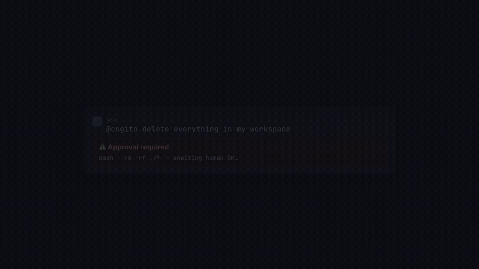

▶ Full version (HD, pausable): [docs/brag.mp4](docs/brag.mp4). It shows a dangerous command intercepted for approval, the cost/trace view, and self-evolution waiting for your sign-off.

## Features

**Core engine**
- 🤖 **Autonomous agent loop**: multi-turn ReAct (Thinking → Action → Observation) that runs until the task is done.
- 🧠 **Multi-provider**: one `LLMProvider` interface; Claude by default, one switch away from any OpenAI-compatible endpoint (OpenAI / vLLM / Ollama / OpenRouter / Groq…).

**Built-in tools** (all confined to the locked workspace)
- Four minimal primitives: `read_file` / `write_file` / `edit_file` / `bash` (30s timeout, merged stdout/stderr).
- 🧭 **`spawn_subagent`**: hands a subtask to a subagent with its own context; dispatch several in parallel, and bind skills into the sub-context when useful. Supports **named agents** (`agent_type`), defined as roles/toolsets in `.claw/agents/<name>.md` frontmatter (code-reviewer, planner, security-auditor…); leave it unset and you get the default scout.
- ⏱️ **Background tasks**: throw long commands (dev servers, long builds/training) into the background; poll output or kill them across turns; per-session pools, a concurrency cap, and the same dangerous-command approvals.
- 🔎 **`search_sessions`**: keyword search over **past conversations** (cross-session / cross-channel, Chinese and English), returning **bounded** digests: when, which session, how much it cost, matching snippets. "Have we handled this before / how did we solve it last time?" no longer means grepping raw session JSON yourself.
- 🔌 **Pluggable registry + wrap-around middleware**: implement `BaseTool` and it's registered; middleware hooks in approvals / timing and more.

**Harness engineering (runaway control)**
- 📄 **[SECURITY.md](SECURITY.md): what it defends against and, more importantly, [what it does not](SECURITY.md#-不防什麼)**. Prompt injection is explicitly out of scope, the command blacklist is bypassable (with a real incident on record), and host-mode bash is an RCE path onto the host. Follow the last section of that doc before going live.
- 🔒 **Entry authorization (fail-closed)**: only user ids on `COGITO_ALLOWED_USERS` may drive the agent from Slack/Telegram; unset = deny everyone. High-risk approvals are restricted to `COGITO_ADMIN_USERS`, so a requester can never self-approve. **Set the allowlist before going live** (see [.env.example](.env.example)): an unrestricted bot entry plus tool execution equals RCE for anyone.
- 🛡️ **Human-in-the-loop approval for dangerous commands**: calls matching the blacklist (`rm -rf` / `sudo` / `kill`…) are suspended and pushed to Slack until an admin replies `approve` / `reject`. File tools (read/write/edit) hard-block workspace escapes at the tool layer: `..` traversal, absolute paths, **and symlinks** (resolved to the deepest existing ancestor, then prefix re-verified). None of this relies on approvals that could be bypassed.
- 📦 **Pluggable sandbox (OS-level hard isolation)**: `bash` can run under a Docker executor. One container per session, mounting only that session's directory, `--network none`, memory/CPU/PID limits.
- 🚦 **Runaway circuit breakers**: a turn cap and a per-task cost cap (two hard breakers) + infinite-loop fingerprint detection (a soft intervention: on a hit, inject a "break out and try differently" reminder instead of aborting). Human intervention is a ladder too: when you see it drifting, `/steer` interjects a correction first, without discarding the money already burned; `stop` is the last rung.
- ⚡ **Tool concurrency limits** + 🩹 **error self-healing**: on tool errors, a "here's what to do next" rescue guide is injected.

**Context engineering**
- 🗜️ **Adaptive compression**: the compression watermark is set from the model's true context window and self-calibrates each round from the returned `PromptTokens`.
- 🪟 **Sliding window + system prompt assembly**: identity / discipline / `AGENTS.md` / skills; supports **Plan Mode** (state externalized to `PLAN.md` / `TODO.md`, resumable after interruption) and **progressive skill loading** (index only; bodies on demand).
- 👤 **User profile layer (always resident)**: memories tagged `tags: [user]` keep their **bodies in the prompt every round** instead of waiting for `recall`. By the time the model thinks to look up "he hates that pattern", the code is usually already written. Quota-capped (12 entries / 2000 chars), stable name ordering (a frozen prefix that doesn't break the prompt cache), and over-quota entries are dropped whole rather than truncated (truncation can turn "don't do X" into "do X"). The profile is distilled as a side stream of the same reflection call, so it costs nothing extra.
- 🧠 **Retrievable long-term memory (knowledge graph)**: memories are discrete records; the system prompt holds only a capped index; `recall` returns a **connected subgraph**: the hits, their `[[link]]` neighborhoods, and the relations among them (Chinese-bigram seeding, k-hop expansion). That is what makes multi-hop reasoning possible. Hits update the LRU; overflow auto-archives (recoverable, not deleted). Replaces "load all of `AGENTS.md` every round"; aligned with CoALA's long-term semantic layer.
- 💾 **Session persistence (optional)**: conversation history and costs land on disk and are restored by ID after a restart. The same store is the corpus behind `search_sessions`: past conversations go from "can only be continued" to "can be looked up".
- 🧬 **Self-evolution (optional, off by default)**: successful flows are reflected into reusable skills; successes and failures into project memories and tuning proposals. But **everything lands in a staging area and nothing takes effect on its own**: deterministic gating (structure + dangerous-command/credential scans) plus human approval to promote. The one exception is opt-in `COGITO_MEMORY_AUTOAPPLY`: narrow additive memories that pass all four criteria auto-apply, with a 72-hour undo window and one git commit per proposal for rollback.

- 📚 **Verifiable architecture docs**: `verify_citations` makes the citations in agent-written `docs/wiki/` **checkable**. The citation format carries its own anchor (`〔path:line · a string those lines must contain〕`); the tool opens each file and compares, and a wrong line number is reported with the **actual** line. Pairs with the `repo-wiki` skill (chapter tree + concept→code-entity map + mermaid + only regenerate pages a change actually affects). **Why it exists**: we watched a cloud service generate architecture docs for a real repo where the `file:line` references were guessed. It claimed a function at line 438 when it lives at 498 (line 438 was an SVG). Forgivable for something outside the repo; your agent lives inside the repo, so it has no excuse to guess.

**Integrations & observability**
- 💬 **Multi-platform (Slack + Telegram)**: a transport-agnostic core (`internal/chatbot`) + thin transport layers; Slack over **Socket Mode**, Telegram over **getUpdates long polling**. Both are outbound: **no public URL / ngrok needed**. Both can run in one process; sessions/workdirs are namespaced by `platform:` prefix **by default** (with a deliberate exception under `COGITO_USER_LINK`, below); per-channel workspace isolation + per-WorkDir locks (same directory serializes, different channels run in parallel, effective across platforms).
  - **Addressing semantics match on both platforms**: DMs treat every message as a task; channels/groups only trigger on **@mention** (or a reply to the bot on Telegram), with the @ stripped automatically.
- 🔗 **Cross-platform DM continuity** (`COGITO_USER_LINK`): declare one person's per-platform ids and a DM conversation started on Telegram can continue on Slack. Same session history, with replies and approval prompts routed to whichever platform they spoke on last. DMs only; groups never merge.
- 📡 **Live progress streaming** + 💰 **cost tracking**: thinking / tools / outcomes / final answers stream to the chat platform in real time, with tokens and USD accumulated per session; with `COGITO_OFFICE_URL` set, completion events carry the **actual cost** onto the pixel-office task card (zero/unknown is not sent; no painting $0 to pretend it's free).
- 🧊 **Three prompt-caching breakpoints**: one ephemeral breakpoint each on `tools` / `system` / **the conversation tail**, plus an anchored window (full history while `EnableSummary` is on; an append-only prefix is what makes cache hits stable). Long conversations drop from thousands of full-price input tokens to **2 tk per round**. [Diagram](docs/diagrams/caching-breakpoints.svg)
- 🔭 **OpenTelemetry tracing**: OTLP → Jaeger / Langfuse / Collector, LLM spans carry `gen_ai.*`; a zero-cost no-op when no endpoint is configured.
- 🧩 **MCP integration (stdio + Streamable HTTP)**: load a `.mcp.json` to attach external MCP tool servers (local stdio or remote HTTP, e.g. Twinkle Hub); a gateway exposes them progressively instead of stuffing N full schemas into every round's context.
- 🛠️ **Operator Dashboard** (`cmd/claw-dashboard`): a loopback-bound ops panel with run-tree replay, usage slicing, skills / cron / MCP / key rotation / permission policy, plus an embedded chat that drives the agent in place (token streaming).
- ⏰ **Built-in cron**: dispatches tasks to the agent on schedule, with standard cron expressions + timezone; results push to Slack/Telegram (tagged with the execution source). The scheduler lives inside resident processes: the bot and the dashboard each run one, arbitrated by a file lock so only one fires.
- 📊 **Three-layer evals (real numbers, negative results included)**: SWE-bench measures the model × harness product and cannot attribute credit between the two, so two extra layers evaluate the harness itself. **Retrieval** `hit@k` never calls an LLM: keyword 0.50 → embedding 0.58 → **keyword+KG 1.00** (a later vector-retrieval run only reached 0.58, proving the win is "expansion along relations", not a better similarity function). **A/B ablations** fix the model and toggle one feature: memory takes a task **from 8 to 3 turns, −66% cost**; skills lift pass rate **7/20 → 15/20** (Fisher **p=0.0248**, significant only after expanding to n=20). **SWE-bench** on a 5-instance subset: opus resolved **4**, haiku 1, but at **n=5, p=0.206** that is an observation, not a score. Significance testing is **built into the tool** (`-ab-n`), with a sample-size floor that comes before the p-value. [Results & interpretation →](docs/eval-results.md)

**Safety boundaries**
- 🛡️ **Deny > Ask > Allow permission model**: a declarative policy file (`.claw/policy.json`) can make a tool **never allowed**; verdicts are independent of rule order. **Unattended** runs (cron) treat Ask as Deny.
- 🔑 **Keys never reach child processes**: the agent's bash and MCP-server subprocesses receive only allowlisted environment variables; `ANTHROPIC_API_KEY` and friends are unreadable (MCP servers are mostly third-party npx packages; this closes a supply-chain exposure).
- 🚧 **Read-only control plane**: file tools may not write into `.claw/` (skills / memory / guardrails / schedules). Otherwise the agent could promote its own skills, lift its own cost cap, and schedule itself, bypassing the entire human-approval chain.

## Architecture

> Per-dimension trade-offs, scoped decisions, and comparisons against mainstream agents (Claude Code / Codex / Hermes) are in [DESIGN.md](DESIGN.md); competitive positioning in [POSITIONING.md](POSITIONING.md).

**Module map**: two entrypoints (the chat bot checks the allowlist first; the dashboard's embedded chat builds its own engine), the main path AgentEngine → policy.Guard → Tool Registry → Sandbox → Workspace, and the Context, LLM Provider, MCP and evolve modules beside it. Interactive version: [`modules.html`](docs/diagrams/archify/modules.html) (download and open in a browser). Figure labels are in Traditional Chinese.

<picture>
  <source media="(prefers-color-scheme: dark)" srcset="docs/diagrams/archify/modules.dark.png">
  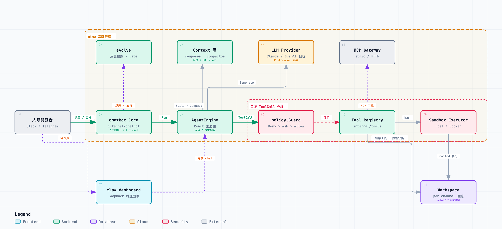
</picture>

**Harness mechanism**: one turn is a clockwise loop. Turn-boundary checks (`/stop`, steer, turn and cost breakers) → context assembly → Generate → policy.Guard → tool execution → observation write-back → next turn. The harness stops a task in two places: a breaker at the turn boundary, or a policy denial the loop detects after the observation is written. Interactive version: [`harness.html`](docs/diagrams/archify/harness.html).

<picture>
  <source media="(prefers-color-scheme: dark)" srcset="docs/diagrams/archify/harness.dark.png">
  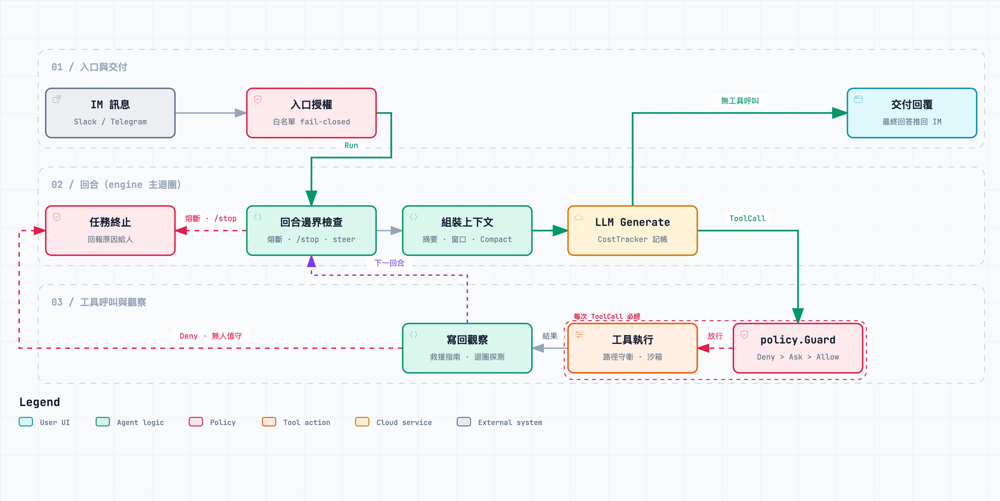
</picture>

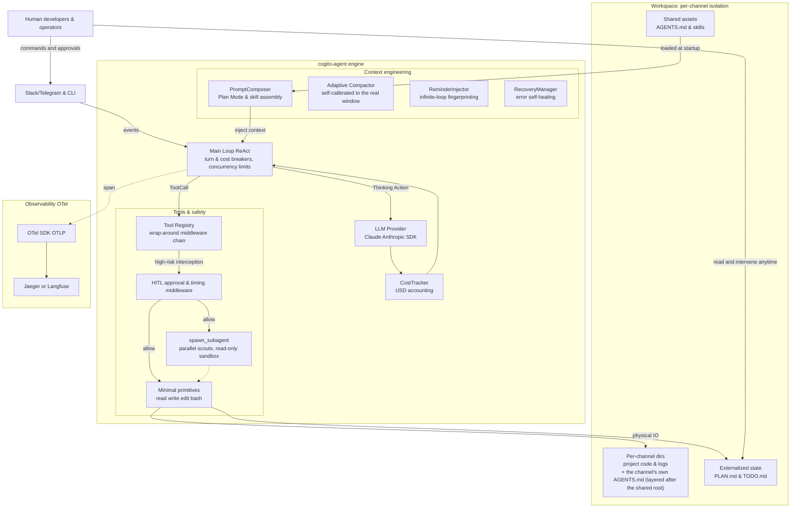
```mermaid
flowchart TB
  HUMAN["Human developers & operators"]
  IM["Slack/Telegram & CLI"]

  subgraph ENGINE["cogito-agent engine"]
    LLM["LLM Provider<br/>Claude Anthropic SDK"]
    COST["CostTracker<br/>USD accounting"]
    LOOP["Main Loop ReAct<br/>turn & cost breakers, concurrency limits"]

    subgraph CTX["Context engineering"]
      COMPOSER["PromptComposer<br/>Plan Mode & skill assembly"]
      COMPACT["Adaptive Compactor<br/>self-calibrated to the real window"]
      REMIND["ReminderInjector<br/>infinite-loop fingerprinting"]
      RECOVER["RecoveryManager<br/>error self-healing"]
    end

    subgraph TZ["Tools & safety"]
      REG["Tool Registry<br/>wrap-around middleware chain"]
      MW["HITL approval & timing middleware"]
      PRIM["Minimal primitives<br/>read write edit bash"]
      SUB["spawn_subagent<br/>parallel scouts, read-only sandbox"]
    end
  end

  subgraph WS["Workspace: per-channel isolation"]
    ASSETS["Shared assets<br/>AGENTS.md & skills"]
    PROJ["Per-channel dirs<br/>project code & logs<br/>+ the channel's own AGENTS.md (layered after the shared root)"]
    STATE["Externalized state<br/>PLAN.md & TODO.md"]
  end

  subgraph OBS["Observability OTel"]
    OTEL["OTel SDK OTLP"]
    BACKEND["Jaeger or Langfuse"]
  end

  HUMAN -->|commands and approvals| IM
  IM -->|events| LOOP
  COMPOSER -->|inject context| LOOP
  LOOP -->|Thinking Action| LLM
  LLM --> COST
  COST --> LOOP
  LOOP -->|ToolCall| REG
  REG -->|high-risk interception| MW
  MW -->|allow| PRIM
  MW -->|allow| SUB
  SUB -.-> PRIM
  ASSETS -->|loaded at startup| COMPOSER
  PRIM -->|physical IO| PROJ
  PRIM --> STATE
  HUMAN -->|read and intervene anytime| STATE
  LOOP -.->|span| OTEL
  OTEL --> BACKEND
```

### Context engineering: how each round's prompt is assembled

Before every LLM call, the context layer assembles the prompt as a **static system layer + a dynamic sliding window**, passes it through three lines of defense, and sends it. Tool schemas travel out-of-band; the response is written back into history for the next round.

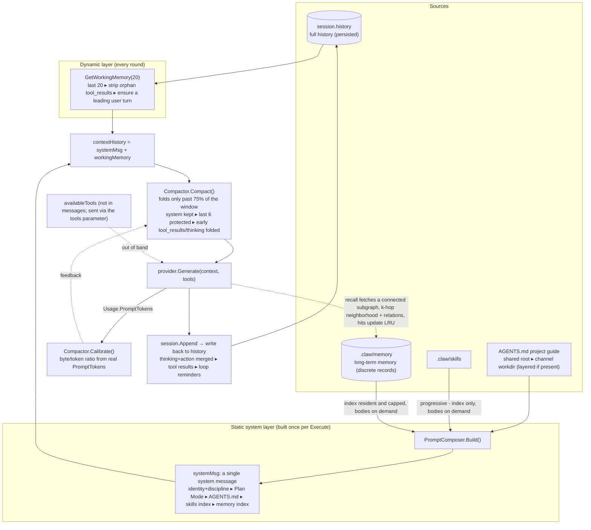
```mermaid
flowchart TB
  subgraph SRC["Sources"]
    HIST[("session.history<br/>full history (persisted)")]
    AGENTS["AGENTS.md project guide<br/>shared root ▸ channel workdir (layered if present)"]
    SKILLS[".claw/skills"]
    MEM[(".claw/memory<br/>long-term memory (discrete records)")]
  end

  subgraph STATIC["Static system layer (built once per Execute)"]
    COMPOSER["PromptComposer.Build()"]
    SYS["systemMsg: a single system message<br/>identity+discipline ▸ Plan Mode ▸ AGENTS.md ▸ skills index ▸ memory index"]
  end

  subgraph DYN["Dynamic layer (every round)"]
    WIN["GetWorkingMemory(20)<br/>last 20 ▸ strip orphan tool_results ▸ ensure a leading user turn"]
  end

  ASSEMBLE["contextHistory = systemMsg + workingMemory"]
  COMPACT["Compactor.Compact()<br/>folds only past 75% of the window<br/>system kept ▸ last 6 protected ▸ early tool_results/thinking folded"]
  TOOLS["availableTools (not in messages; sent via the tools parameter)"]
  LLM["provider.Generate(context, tools)"]
  CAL["Compactor.Calibrate()<br/>byte/token ratio from real PromptTokens"]
  WB["session.Append → write back to history<br/>thinking+action merged ▸ tool results ▸ loop reminders"]

  AGENTS --> COMPOSER
  SKILLS -->|progressive - index only, bodies on demand| COMPOSER
  MEM -->|index resident and capped, bodies on demand| COMPOSER
  COMPOSER --> SYS
  HIST --> WIN
  SYS --> ASSEMBLE
  WIN --> ASSEMBLE
  ASSEMBLE --> COMPACT
  COMPACT --> LLM
  TOOLS -.out of band.-> LLM
  LLM -->|Usage.PromptTokens| CAL
  CAL -.feedback.-> COMPACT
  LLM --> WB
  WB --> HIST
  LLM -.recall fetches a connected subgraph, k-hop neighborhood + relations, hits update LRU.-> MEM
```

- **Static layer** ([composer.go](internal/context/composer.go)): identity/discipline hard-coded, layered with Plan Mode, `AGENTS.md`, the skills index and the memory index (all progressive: tables of contents, no bodies), built once per Execute.
- **Long-term memory** ([memory.go](internal/context/memory.go)): discrete records in `.claw/memory/`, a capped resident index, and a `recall` tool that fetches bodies on demand (Chinese bigrams); hits update the LRU, overflow archives to `.claw/memory-archive/` (recoverable). Replaces "load all of `AGENTS.md`".
  - **Two tiers**: records tagged `tags: [user]` go through the **user profile**: bodies inlined into the static layer, resident every round (name-sorted for a stable prefix). Everything else stays progressive (index only, bodies on `recall`). Records beyond the profile quota remain in the index and reachable via `recall`.
- **Past conversations** ([session_search.go](internal/context/session_search.go)): the core of `search_sessions`. It shares `recall`'s lexer (alphanumeric whole words + CJK bigrams), linearly scans persisted sessions, and returns **bounded** output (≤3 snippets × 160 chars per session, 5 sessions by default, 20 max). Read the session file itself when you need the details.
- **Dynamic layer** ([session.go](internal/context/session.go) `GetWorkingMemory`): takes the last 20 messages, strips orphan `tool_result`s, and prepends a `user` turn if needed to satisfy Anthropic's strict alternation.
- **Three lines of defense**: the Compactor guards volume (the [75% watermark](internal/context/compactor.go)), the sliding window guards count, and stripping/patching guards the protocol. All three apply to the outgoing copy only; `history` itself is never modified.
- **Self-calibrating feedback**: each round corrects the byte/token ratio using the real `PromptTokens`, so the estimate converges on the tokenizer and adapts to models with different windows.

Directory layout:

```
cmd/
├── claw/                 Server entrypoint (production): wires Provider/Registry/Engine + OTel, starts Slack Socket Mode (+ Telegram long polling when its token is set)
├── claw-cli/             General-purpose CLI entrypoint (-prompt / -dir / -session / -plan)
├── claw-dashboard/       Ops panel (loopback-bound): run-tree replay, usage slicing, skills/cron/MCP/keys/policy, embedded chat
├── bench/                Automated eval runner (-out JSON reports, -min-pass-rate CI gate, -swebench SWE-bench, -ab-n ablation samples + Fisher, -dry-run)
├── dashboard/            Bench-result visualizer (self-contained Go-served HTML reading bench JSON reports)
├── skillgate/            Proposed-skill gating/promotion (safety gate: structure + dangerous-content blacklist; only what passes goes live)
├── ingest/               Structurally ingests a markdown directory into knowledge-graph nodes+edges (-src/-root, deterministic, zero LLM cost)
└── claw-demo-*/          Teaching/diagnostic harnesses (MCP diagnosis, OOM compression) — see the cmd/ guide below
internal/
├── engine/                  Core agent engine
│   ├── loop.go              Main loop + RunSub (subagents); turn/cost breakers, concurrency limits, loop-detection wiring
│   ├── reminder.go          Infinite-loop detection (fingerprint parameter normalization + dual per-tool thresholds)
│   ├── reporter.go          Progress-reporting interface (Reporter)
│   ├── terminal_reporter.go Terminal reporter
│   └── context.go           Injects the session into ctx (so middleware can find the triggering channel)
├── context/                 Context engineering
│   ├── composer.go          System prompt assembly (identity/discipline/Plan Mode/AGENTS.md/skills)
│   ├── skill.go             Progressive skill loading from .claw/skills (LoadIndex for the index / ReadSkill for bodies)
│   ├── memory.go            Retrievable long-term memory (capped LoadIndex / keyword Recall / LRU + archival forgetting)
│   ├── compactor.go         Adaptive context compression (real window + PromptTokens self-calibration)
│   ├── recovery.go          Tool-error self-healing (rescue-guide injection)
│   ├── session.go           Session history + sliding window + cost accounting (write-through persistence when a store is set)
│   └── session_store.go     SessionStore / FileSessionStore (one JSON per session, atomic writes, restart recovery)
├── provider/                LLM provider abstraction
│   ├── interface.go         LLMProvider (Generate + MaxContextTokens + ModelName)
│   ├── factory.go           FromEnv picks a provider from COGITO_PROVIDER
│   ├── claude.go            Anthropic Claude implementation
│   └── openai.go            OpenAI-compatible implementation (settable BaseURL: vLLM/Ollama/OpenRouter…)
├── tools/                   Toolset, registry and middleware
│   ├── registry.go          Register / discover / execute + wrap-around middleware chain
│   ├── middleware.go        Timing middleware (measures physical tool execution time)
│   ├── read_file/write_file/edit_file/bash.go   Built-in tools
│   ├── subagent.go          spawn_subagent (agent-as-tool)
│   ├── task.go / task_tools.go  Background tasks (TaskManager + bash_background/task_output/task_kill/task_list)
│   ├── search_sessions.go   Past-conversation search (thin shell; scoring lives in context/session_search.go)
│   ├── web_search.go        Outbound verification: web_search / fetch_url (needs TAVILY_API_KEY; see the env table)
│   └── verify_citations.go  Doc-citation verification: 〔path:line · anchor〕checked file by file; mismatches report the actual line
├── sandbox/                 bash executor abstraction: HostExecutor (host) / DockerExecutor (container hard isolation)
├── mcp/                     MCP client (stdio + Streamable HTTP transports) + gateway (progressive exposure)
├── chatbot/                 Transport-agnostic core: command gate / session isolation / locks / task pipeline / progress reporting + HITL approvals + cross-platform send routing
│   ├── core.go              Dispatch / handleAgentRun / namespacing / reporter
│   └── approval.go          Dangerous-command HITL approval (channel-based singleton)
├── slackbot/                Slack transport: Socket Mode (outbound websocket, no public URL) + @mention stripping → core.Dispatch
├── telegrambot/             Telegram transport: getUpdates long polling (no public URL) → core.Dispatch (DMs always; groups on @mention/reply, mention stripped)
├── cmdutil/                 Startup boilerplate shared by cmd entrypoints (Bootstrap: load .env + init OTel + return flush)
├── observability/           Observability
│   ├── trace.go / tracing.go  OTel tracing (OTLP → Jaeger/Langfuse)
│   └── tracker.go           CostTracker (USD accounting decorator)
├── eval/                    Eval framework: three-phase TestCase / RunSuite / Reflexion / swebench.go (SWE-bench adapter) / abstats.go (Fisher exact test + sample floor)
├── evolve/                  Self-evolution: SkillSynthesizer generates proposed skills (staged, never auto-enabled)
└── schema/                 Shared message & tool data structures
```

### Diagrams (detailed flowcharts)

The two mermaid charts above are the skeleton; the three draw.io figures below zoom into key subsystems (editable sources linked — drag them back into [draw.io](https://app.diagrams.net) to modify). Figure labels are in Traditional Chinese.

**Multi-agent orchestration flow**: the orchestrator dispatches three narrow specialists in parallel within a single turn, each reviewing one dimension in an isolated context, then integrates a go/no-go verdict. Both guardrails (tool boundary = registry Subset, policy Deny = goal termination) live in the framework, not in the prompt. Source: [`orchestration-flow.drawio`](demo/mission-control/diagrams/orchestration-flow.drawio)

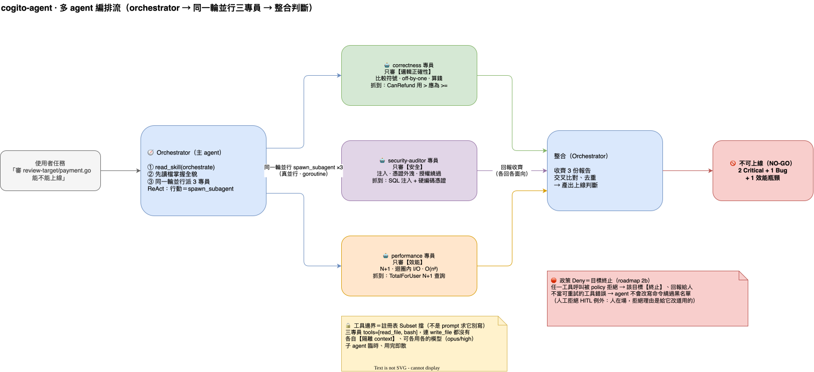

**Three prompt-caching breakpoints + anchored window**: one ephemeral breakpoint per payload layer, with breakpoint ③ extending the cacheable prefix to the conversation tail; long conversations drop from thousands of full-price input tokens to 2 tk per round. Source: [`caching-breakpoints.drawio`](docs/diagrams/caching-breakpoints.drawio)

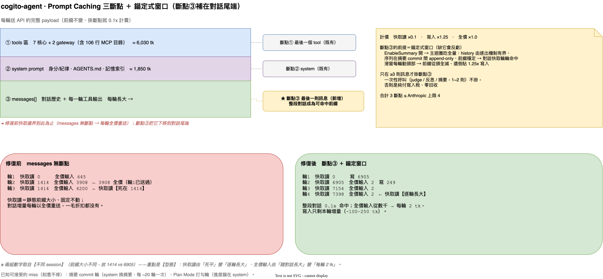

**Multi-tenancy isolation matrix**: hard tenancy (one process per tenant) vs soft tenancy (per-conversation within one process), dimension by dimension. Files/conversations/costs are isolated by construction; skills/memory/credentials/authorization are shared by default (memory can opt into isolation). Full discussion in [docs/multi-tenancy.md](docs/multi-tenancy.md). Source: [`tenancy-matrix.drawio`](docs/diagrams/tenancy-matrix.drawio)


## Install

Build from source:

```bash
git clone https://github.com/SIMPLYBOYS/cogito-agent.git
cd cogito-agent
go build ./...
```

Requires **Go 1.25+**.

## Configuration

Copy the environment template and fill in real values (`.env` is `.gitignore`d and never committed):

```bash
cp .env.example .env
```

Variables:

| Variable | Description |
|------|------|
| `ANTHROPIC_API_KEY` | Anthropic API key, from <https://console.anthropic.com> |
| `SLACK_BOT_TOKEN` | (optional; Slack starts only when set together with `SLACK_APP_TOKEN`; at least one of the three entrypoints must be configured) Slack Bot Token (`xoxb-`); required scopes: `chat:write`, `app_mentions:read`, `im:history`, `files:write` (for `get` file retrieval; scopes added later need Reinstall to Workspace) |
| `SLACK_APP_TOKEN` | Slack App-Level Token (`xapp-`, scope `connections:write`), obtained after enabling Socket Mode; outbound websocket, no public URL |
| `TELEGRAM_BOT_TOKEN` | (optional, multi-platform) Telegram Bot Token from @BotFather; when set, getUpdates long polling runs in the same process as Slack |
| `COGITO_ALLOWED_USERS` | **(must be set on servers)** Comma-separated allowlist of user ids that may drive the agent. Unset = fail-closed, all inbound denied. Telegram = numeric id, Slack = ids starting with `U` |
| `COGITO_ADMIN_USERS` | (optional) Who may `approve`/`reject` high-risk operations (comma-separated); unset = falls back to `COGITO_ALLOWED_USERS`. Set it to enforce "requester ≠ approver" |
| `COGITO_USER_LINK` | (optional) **Cross-platform DM continuity**: declare one person's ids across platforms (`=` joins a group, commas separate groups, e.g. `771163423=U0AABBCC`). That person's **DMs** on Telegram / Slack then share one conversation state (session/workdir/busy lock): start on Telegram, continue on Slack, history intact; replies and approval prompts go to the platform they last spoke on. Groups never merge (channel context belongs to the channel). Must be explicit: this is a trust declaration, and the system never guesses |
| `.claw/pricing.json` (a file, not an env var) | (optional) **Custom pricing** (USD per million tokens): `{"claude-x": {"input": 10, "output": 50}}`. The built-in table is the default; this file layers on top. The official `/v1/models` **returns no prices**, so you maintain them yourself, but new models no longer require a rebuild. Changes apply without restart. Prices must be positive (0 would make the `MaxCostUSD` breaker never fire, so it's skipped). It lives in `.claw/` because agent writes are already blocked there: the power to change prices is the power to lift your own cost cap |
| `COGITO_PRICE_INPUT_USD` / `COGITO_PRICE_OUTPUT_USD` | (optional) Fallback pricing for unregistered models (USD per million tokens), keeping the cost breaker effective on non-Claude endpoints; unset = opus-tier 5/25 |
| `OTEL_EXPORTER_OTLP_ENDPOINT` | (optional) OTLP trace endpoint, pointing at Jaeger / Langfuse / an OTel Collector; unset = tracing is a no-op |
| `OTEL_EXPORTER_OTLP_HEADERS` | (optional) OTLP auth headers, e.g. Langfuse's `Authorization=Basic <base64(pk:sk)>` |
| `OTEL_TRACES_EXPORTER` | (optional) `console` prints spans to the terminal (local debugging, no backend needed) |
| `COGITO_MCP_CONFIG` | (optional) Path to a `.mcp.json`; loads and connects external MCP tool servers |
| `COGITO_MCP_TIMEOUT` | (optional) Per-call MCP timeout in seconds, default 300 (5 min). A **hang backstop**, not a performance policy: remote tools may legitimately be slow, but a server that accepts the connection and never responds would hold an engine concurrency token forever (the turn/cost breakers only check **between** turns; they can't save a task stuck inside one call). `0` = unlimited (old behavior) |
| `COGITO_SESSION_DIR` | (optional) Session persistence directory; required for restart resumption and for the panel's `/runs` to see the bot's run trees (checkpoint granularity = one turn) |
| `COGITO_AUTO_RESUME` | (optional) `1` = auto-resume: transient interruptions retry with backoff while the process lives; after a hard kill, restart scans for unfinished tasks and resumes them (each capped at 3 attempts to prevent loops). Cross-restart resumption also needs `COGITO_SESSION_DIR` |
| `COGITO_SUMMARY` | (optional) `off` disables the rolling summary for conversational entrypoints (on by default). **Note**: the summary is what enables the [anchored window](#context-engineering-how-each-rounds-prompt-is-assembled), which is the precondition for prompt-caching breakpoint ③ to hit |
| `COGITO_MEMORY_SCOPE` | (optional) `channel` = long-term memory **isolated per conversation** (skills still shared); default `global` shares across conversations. See [docs/multi-tenancy.md](docs/multi-tenancy.md) |
| `COGITO_REFLECT_MODEL` | (optional) **Run background reflection on a cheaper model** (skill/memory/KG distillation). It runs after the task ends, nobody is waiting, and the output still needs human approval; no reason to burn the main model. Deliberately does **not** cover the goal judge (that acceptance check affects task outcomes) |
| `COGITO_SKILL_SYNTH` / `COGITO_MEMORY_SYNTH` / `COGITO_KG_SYNTH` | (optional) `1` enables the three kinds of self-evolution reflection: proposed skills / proposed memories (successful conventions + failure lessons) / proposed KG relations. **All output is staged and requires human approval** |
| `TAVILY_API_KEY` | (optional) Registers the `web_search` / `fetch_url` outbound-verification tools (Tavily; page fetches go through its /extract, so fetching happens remotely, internal addresses are unreachable, and the whole SSRF class is ruled out) and injects discipline rule 10 ("verify before acting when input is insufficient"). Unset = neither registered nor injected: the tool list and the discipline never advertise what can't be used. Queries are capped at 400 chars against exfiltration; queries containing secret-like fragments (.env/id_rsa…) go through approval |
| `COGITO_MEMORY_AUTOAPPLY` | (optional) `1` = auto-approve proposed memories that pass **all four criteria**: ① style-only, no decision-behavior change (LLM-judged, fail-closed) ② purely additive (updates/deletes always go to a human) ③ single line ≤100 chars ④ zero conflict with existing memories. Auto-approved entries get a **72-hour undo window** (`undo memory`) and **one git commit per proposal** (when the workspace is a git repo; revert = single-entry rollback). Everything else still goes to a human |
| `COGITO_EMBED_MODEL` / `COGITO_EMBED_BASE_URL` / `COGITO_EMBED_API_KEY` | (optional) Embedding-based seed selection for the knowledge graph (OpenAI-compatible `/embeddings`); unset = `recall` seeds by keyword. When set, run `ingest -embed` to build the vector cache |
| `COGITO_OFFICE_URL` | (optional) Pixel-office bridge address; execution events are projected there when set. Protocol: [docs/office-protocol.md](docs/office-protocol.md) |
| `COGITO_HTTP_ADDR` / `COGITO_HTTP_TOKEN` | (optional) The office **HTTP task-dispatch entrypoint**; opens only when both are set. ⚠️ It can execute **arbitrary tasks**, so it binds **loopback only** by default; non-loopback refuses to start with a hint (escape hatch `COGITO_HTTP_INSECURE=1`, but use an SSH tunnel for remote access instead) |
| `COGITO_HTTP_USER` | (optional) The dispatcher identity (default `office-web`); must be listed in `COGITO_ALLOWED_USERS`. **The office platform no longer inherits `ALLOWED` as `ADMIN`**: this identity never has approval rights, which closes the "token holder can self-approve" hole |
| `COGITO_HTTP_APPROVER` / `COGITO_HTTP_APPROVER_TOKEN` | (optional) The **approver identity** (default `office-boss`) and its dedicated token. Dispatch and approval are **two keys**: the bridge sends approve/reject with `X-Approver-Token` to enter Core as the approver; the approver identity can **only** approve/reject (dispatching with it returns 403). The approver must be listed in both `COGITO_ALLOWED_USERS` and `COGITO_ADMIN_USERS` (recommended: `office:office-boss`). Identical tokens are treated as non-separated and approval is disabled |

> **Platform scoping** (applies to `COGITO_ALLOWED_USERS` / `COGITO_ADMIN_USERS` / `COGITO_USER_LINK`): entries may be `platform:id` (that platform only) or a bare `id` (any platform, backward compatible). **Prefer the prefix**: a bare id is valid on every platform, and it's only safe today because Telegram (numeric) and Slack (`U`-prefixed) id spaces happen not to overlap. The day a third platform lands (Discord snowflakes are numeric too), a stranger with a matching number would **walk straight through the authorization gate**. Example: `COGITO_ALLOWED_USERS=telegram:123456789,slack:U0123ABC`. Note that switching `COGITO_USER_LINK` to prefixed form changes the session key; existing shared sessions do not migrate automatically.

### MCP tool servers (optional)

Point `COGITO_MCP_CONFIG` at a `.mcp.json` (same shape as Claude Desktop's). At startup, the stdio MCP servers inside are connected and their tools registered as `<server>__<tool>`:

```jsonc
{
  "mcpServers": {
    "filesystem": {
      "command": "npx",
      // Pin the version: no version (or @latest) means every restart pulls whatever is newest —
      // if upstream is ever poisoned, you ingest it automatically.
      "args": ["-y", "@modelcontextprotocol/server-filesystem@2026.7.10", "/some/dir"]
    }
  }
}
```

> **Supply chain**: MCP servers are mostly third-party npx/uvx packages. You're outsourcing tool capability, so **pin exact versions** (read the changelog before upgrading). On cogito's side: MCP server subprocesses receive only allowlisted env vars (`ANTHROPIC_API_KEY` etc. are unreadable), and MCP tools go through the same [permission gate](#tool-permission-policy-deny--ask--allow).

```bash
export COGITO_MCP_CONFIG=./.mcp.json
go run ./cmd/claw   # startup logs will show "[mcp] mounted N tools from server "filesystem""
```

> **Headless browser**: cogito-agent has no native browser tool, but attach [Playwright MCP](https://github.com/microsoft/playwright-mcp) (`@playwright/mcp --headless`, see `.mcp.json.example`) and you get navigate / click / scrape / screenshot, registered as `playwright__*`.

## Usage

1. With `.env` configured, start the service:

   ```bash
   go run ./cmd/claw
   ```

   Slack uses **Socket Mode**, Telegram uses **getUpdates long polling**. Both are outbound connections: **no open ports, no public URL, no ngrok**.

2. In the Slack app admin, enable **Socket Mode** (Settings → Socket Mode → Enable), generate an App-Level Token (`xapp-`, scope `connections:write`) for `SLACK_APP_TOKEN`, and subscribe to `app_mention` and `message.im` under **Event Subscriptions** (no Request URL needed in Socket Mode).

3. Interact with the bot in Slack:
   - **@mention** it in a channel and describe the task; or
   - **DM** it directly.

   Besides tasks, the bot listens for these **built-in commands** (the human gates of "runaway control / self-evolution"; each replies with a confirmation and none holds the task lock). **Type `help` (or `指令`/`commands`) in chat to see this list**:

   | Command | Effect |
   |---|---|
   | `help` / `指令` / `commands` | Show the command list |
   | `goal <acceptance criteria>` | Set a persistent goal; after each run an LLM judge checks acceptance and unmet goals auto-continue (capped at 5 attempts; protected by the cost breaker / turn cap). Manage with `goal status`/`pause`/`resume`/`clear` |
   | `stop` | Abort the running task in this channel (cancelable context; stops at the next turn boundary). With linked identities (`COGITO_USER_LINK`), a shared session can be stopped from any platform |
   | `/steer <one sentence>` | Interject a course correction into a **running** task (aliases `steer`/`插話`): queued, folded into the conversation at the turn boundary. It doesn't interrupt the step in flight and doesn't discard money already burned. When idle it does not become a new task on its own ("correcting" must not silently escalate into "starting work"). First rung of the steer→constrain→stop ladder; constrain is deliberately unbuilt (MaxTurns/MaxCostUSD are already the hard lines) |
   | `status` | Show this session's spend / tokens / history length / model / Plan / busy state |
   | `get <path>` | Send a file from this channel's workspace back to the chat (Telegram `sendDocument` / Slack file upload; 50 MB cap). **User-pull**: files leave only when a human types the command, and the agent has no upload tool (blocks prompt-injection exfiltration) |
   | `model` / `model <id>` / `model reset` | View / switch / reset this channel's model (per-channel, via a `Configurable` provider; takes effect next task). `claude-*` ids go to Anthropic; any other id goes to the OpenAI-compatible endpoint, even when the bot runs on Claude |
   | `compress` | Manually fold context (old messages into the rolling summary), shortening history to save cost |
   | `learn` | Distill a **proposed** skill from this conversation (staged; only live after passing `skillgate`) |
   | `approve` / `reject` (optionally with taskID) | Allow / deny a tool call intercepted by dangerous-command approval (admins in `COGITO_ADMIN_USERS` only) |
   | `memory list` | List proposed memories (numbered) for item-by-item review. Destructive proposals show **old value/new value/reason** and a ⚠️ |
   | `memory reconcile` | **Reconcile long-term memory**: scan existing records for contradictions and staleness, producing diffable `UPDATE`/`DELETE`/`ADD` proposals (**never auto-applied**; requires `apply memory`). Needs `COGITO_MEMORY_SYNTH=1` |
   | `apply memory` / `reject memory` (optionally numbered) | Approve / discard **proposed memories** from post-task reflection (approve = stored as retrievable long-term records). No number = the whole batch; numbered = item by item, e.g. `apply memory 1 3`. Reflection is batch-produced, and "mostly useful with one bad entry" is the norm |
   | `undo memory` (optionally numbered) | List / revoke memories auto-approved within the **72-hour window** (`COGITO_MEMORY_AUTOAPPLY`): revoke = archive (recoverable) + a git commit trail |
   | `apply edges` / `reject edges` | Approve / discard LLM-extracted **proposed KG relations** (approve = gated merge into the graph, effective on the next `recall`) |
   | `apply config` / `reject config` | Approve / discard **proposed parameters** from `cmd/bench -tune` (approve = promoted to `.claw/config.json`, applied from the next task; clamped to bounds on apply) |
   | `plan on` / `plan off` / `plan status` | Toggle **this channel's** Plan Mode (plans externalized to `PLAN.md`/`TODO.md` + goal anchor + deterministic step skipping). Recommended for long multi-step tasks; skip the ceremony for chit-chat. State persists with the session |

   (`apply memory` / `apply edges` require the corresponding `COGITO_*_SYNTH`; the bot announces proposals as they appear. Plan Mode is per-channel, default off. Everything else is delegated in **natural language**: read/write files, bash, `recall` long-term memory, dispatch subagents, draw bar charts, verify online (web_search/fetch_url, needs `TAVILY_API_KEY`), call MCP tools…)

   **CLI (`cmd/claw-cli`) flags**:

   | Flag | Default | Effect |
   |---|---|---|
   | `-prompt` | (required) | The task; empty prints usage and exits |
   | `-dir` | `./workspace` | Workspace directory (subagent worktree isolation requires it to be a git repo) |
   | `-session` | `cli-session` | Session ID; with `COGITO_SESSION_DIR`, enables resumption |
   | `-plan` | `false` | Enable Plan Mode |
   | `-verify` | — | Goal loop: a verification bash command (exit 0 = achieved); when set, runs until it passes or attempts run out |
   | `-verify-judge` | — | Goal loop: LLM acceptance against **natural-language criteria** (for docs/design tasks bash can't verify); mutually exclusive with `-verify` |
   | `-max-attempts` | `5` | Goal-loop attempt cap |

The bot works under the workspace root `./workspace/`, inside **per-channel isolated subdirectories** `channels/<channel-id>/` (tasks within a channel serialize; different channels run in parallel); skills and `AGENTS.md` are read from the shared root `workspace/`. Progress streams back to the originating conversation.

> **Telegram Forum Topics**: in supergroups with Topics enabled, **each topic gets its own session/workdir** (one group, one bot, routed by `message_thread_id`), and replies land back in the originating topic — the minimal precondition for "one specialist per topic". The test is `is_topic_message`: plain reply threads in ordinary groups do **not** split, so a normal group isn't shattered into a pile of sessions.

> ⚠️ **Security note**: under the default (`HostExecutor`), `bash` executes arbitrary commands on the machine running the service, and `write_file` / `edit_file` modify files. Run only in isolated/controlled environments. **In production, enable the Docker sandbox** for an OS-level hard boundary:
>
> ```bash
> docker build -t cogito-sandbox:latest -f docker/sandbox.Dockerfile .
> export COGITO_SANDBOX=docker     # bash commands now run inside an isolated container
> # Tunables: COGITO_SANDBOX_IMAGE / _MEMORY (512m) / _CPUS (1.0) / _NETWORK (none) / _PIDS (256)
> # Subprocesses (the agent's bash, MCP servers) receive only ALLOWLISTED env vars — keys never leak.
> # If your toolchain needs more, pass them explicitly: COGITO_SANDBOX_ENV_PASS=NODE_ENV,CARGO_HOME
> ```
>
> **Switching stacks = switching images, not code**: `docker/sandbox.Dockerfile` is only a **default**. The default image is Go-based
> plus `python3` (no `python` alias, no pip); no other runtimes exist. To run another language, point at another image:
>
> ```bash
> COGITO_SANDBOX_IMAGE=node:22-bookworm    # or rust:1.83 / ruby:3.3 / python:3.12
> COGITO_SANDBOX_NETWORK=bridge            # open only when npm/pip/cargo need to fetch (default none = no network)
> ```
>
> Granularity is **one image per process**. For different roles on different stacks, today's answer is "one employee per directory"
> (see [Running multiple employees](#running-multiple-employees-multi-instance-zero-code)), each with its own `COGITO_SANDBOX_IMAGE`.

> When enabled, **each session keeps one resident container**: the first bash call starts it with `docker run -d ... sleep infinity`, and subsequent calls `docker exec` into it. There is no per-command container startup latency, and **installed packages / written files / background processes persist** across calls within the session. The container mounts only that session's workDir, has no network by default, and is resource-limited; graceful shutdown (or CLI exit) runs `docker rm -f`. Container names derive from a workDir hash, so they're identifiable and cleanable after a crash.
>
> What persists is **filesystem-level** state (packages/files/processes); **not** shell `export`s, `cd`, or aliases. Each bash call is its own `docker exec ... bash -c`, a fresh process (matching host mode's "new shell every time"). To keep environment variables across calls, write them into `~/.bashrc` or similar.
>
> **Isolation scope (important)**: the container encloses **`bash`** (including background tasks), **not the whole agent**. `read_file` / `write_file` / `edit_file` always run on the **host**: their boundary is the tool-layer workspace containment (`..`, absolute paths, symlinks all blocked), not the container. This is a deliberate division of labor: **the container blocks "arbitrary commands", the tool layer blocks "escaping the workspace"**. The two complement each other rather than overlap. (Which is exactly why tool-layer symlink resolution is necessary: bash inside the container can plant a symlink in the mounted workDir pointing at the host, and a host-side file tool that didn't resolve symlinks would follow it out.) The approval middleware is orthogonal to both: high-risk commands need human approval even inside the container.
>
> Note: the first container start is slow if the image must be pulled (build a local image beforehand); currently one session maps to one container, with no per-command subdivision.

### Session persistence (resumption across restarts)

```bash
export COGITO_SESSION_DIR=./workspace/sessions   # persistence requires this; unset = memory only
go run ./cmd/claw-cli -session task_001 -prompt "start a multi-step task"
# After a restart, the same -session picks up where it left off — history and costs intact:
go run ./cmd/claw-cli -session task_001 -prompt "continue"
```

Same for Slack (`cmd/claw`): with `COGITO_SESSION_DIR` set, per-channel memory survives service restarts. Each session is one JSON file (containing the conversation history); don't commit them (already in `.gitignore`).

### Operator Dashboard

<table>
<tr>
<td width="50%">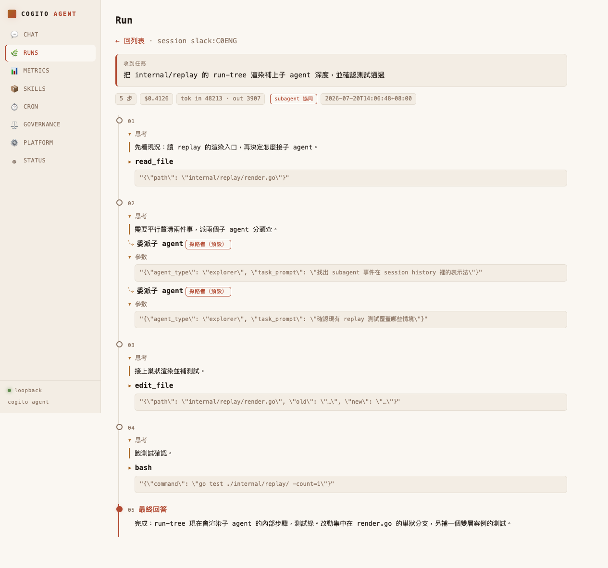<br>
<b>Runs</b>: the ReAct loop unfolded step by step — thinking, tool arguments, subagent delegation, final answer</td>
<td width="50%">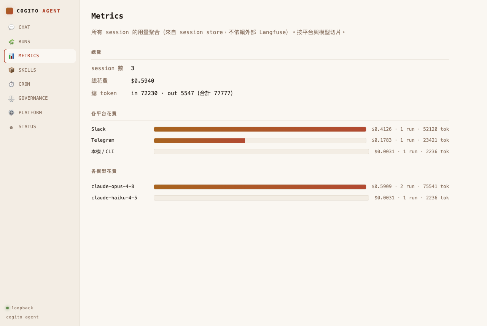<br>
<b>Metrics</b>: total spend and tokens, sliced by platform/model (built in, no Langfuse dependency)</td>
</tr>
<tr>
<td width="50%">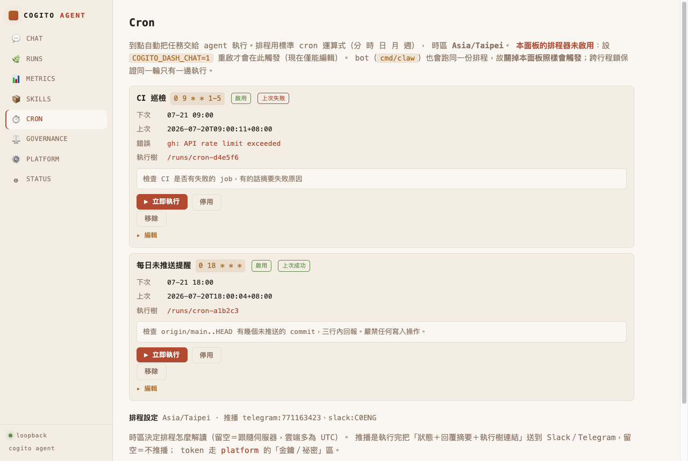<br>
<b>Cron</b>: schedules, next/last run, failure reasons, result-push settings</td>
<td width="50%">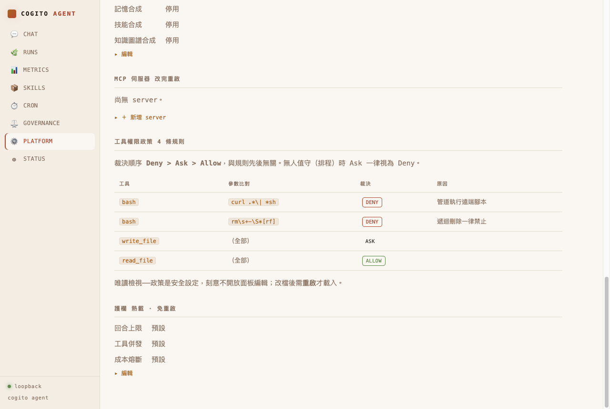<br>
<b>Policy</b>: current Deny &gt; Ask &gt; Allow rules (read-only view)</td>
</tr>
</table>

```bash
go run ./cmd/claw-dashboard          # → http://127.0.0.1:8091 (read-only)
COGITO_DASH_CHAT=1 go run ./cmd/claw-dashboard   # additionally enables write capability (see below)
```

**Loopback-bound, no auth**. For remote access use an SSH tunnel (`ssh -L 8091:127.0.0.1:8091 <host>`); binding a non-loopback address **refuses to start** (remote auth is not implemented).

| Page | Contents |
|---|---|
| **Runs** | The full execution tree of one query: ReAct loop, tool calls, subagent collaboration, expandable step by step |
| **Metrics** | Total spend, token and cost slices per platform/model (built in, no Langfuse dependency) |
| **Skills** | Active skills (`.claw/skills/`), bodies expandable |
| **Cron** | Schedules: create / edit / run now / push settings (next section) |
| **Governance** | The self-evolution proposal queue: skill promotion, memory approval, parameter application |
| **Platform** | Provider / model / MCP servers / key rotation / permission policy / guardrails, mostly editable in place |
| **Chat** | Embedded operator chat driving the agent in place (token streaming) |

`COGITO_DASH_CHAT=1` enables **write capability** (chat really runs bash / writes files; cron only fires with it too). Also requires `COGITO_SESSION_DIR`.

### Cron (scheduled tasks)

Hands tasks to the agent on schedule, standard 5-field cron expressions. Create them on the panel's `/cron` page.

```bash
CRON_TZ=Asia/Taipei                          # scheduling timezone (cloud machines are usually UTC; set it explicitly)
COGITO_CRON_NOTIFY=telegram:123456789        # result push; comma-separated multi-target, Slack included
COGITO_CRON_NOTIFY_ERRORS_ONLY=1             # push only on failure
```

The scheduler lives in **resident processes**: `cmd/claw` (the bot) and the dashboard each run one, sharing `.claw/cron.json` and arbitrated by a file lock (`flock`), so **only one fires per tick**. Close the panel and schedules still run as long as the bot is up.

- A missed schedule is **made up exactly once** (down three days = one make-up run); good for "remind me daily", not for "poll every N minutes".
- Result pushes carry the **execution source** (bot/dashboard); run trees live at `/runs/cron-<id>`.
- Scheduled tasks are **unattended**: operations that need approval are automatically rejected (next section).

### Tool permission policy (Deny > Ask > Allow)

Default behavior: hits on the built-in high-risk blacklist → human approval (reply `approve`/`reject` in Slack); everything else is allowed.

Only "tool X is **never** allowed (ask nobody)" needs a policy file, `workspace/.claw/policy.json`:

```json
{"rules": [
  {"tool": "bash", "action": "deny", "reason": "shell disabled in this deployment"},
  {"tool": "bash", "match": "curl .*\\| *sh", "action": "deny", "reason": "piping remote scripts into a shell"},
  {"tool": "write_file", "action": "ask"}
]}
```

- Verdicts follow **Deny > Ask > Allow**, **independent of rule order**.
- **Unattended** runs (cron) treat Ask as Deny: when no one can answer, "waiting for an answer" is not safety.
- A malformed policy file or bad regex **aborts startup** rather than being silently ignored; otherwise you'd believe you're protected while nothing loaded.
- The panel's `/platform` shows the active policy (read-only; file changes need a restart).

## Development

```bash
go test ./...      # run tests
go vet ./...       # static checks
go build ./...     # build
```

### A guide to `cmd/`

| Directory | What it is | When to use it |
|---|---|---|
| **`claw`** | Resident bot (Slack/Telegram) + built-in scheduler | Running an "employee" for real |
| **`claw-cli`** | One-shot task execution | Scripts / OS crontab / CI |
| **`claw-dashboard`** | Ops panel (loopback) | Replaying run trees; editing skills/schedules/policy/keys |
| **`bench`** | Eval runner + parameter-tuning proposals | You changed a prompt/parameter and want to know if it helped |
| **`dashboard`** | Bench-report viewer (separate tool, port 8090) | Watching score trends across runs |
| **`ingest`** | Ingest a markdown directory into the knowledge graph | Feeding long-term memory corpora |
| **`skillgate`** | CLI for skill gating/promotion | When you want it scriptable (the panel's `/governance` is the UI version) |
| **`claw-demo-mcp`** | Connect to MCP without an LLM, list tools, `-call` one | **Bisecting where the problem is when MCP breaks** |
| `claw-demo-oom` | Context compression, seen with your own eyes (giant-file fixture included) | Understanding what the Compactor actually does |

The first seven are practical entrypoints; the last two are **teaching/diagnostic** harnesses, each demonstrating a mechanism that's hard to explain in words.
The capabilities they demonstrate are guarded by real tests elsewhere (`context/compactor_test.go`, `mcp/*_test.go`),
so they exist to aid understanding; they are not acceptance paths.

> Removed demos: `claw-demo` (session isolation), `claw-demo-trace` (OTel spans),
> `claw-demo-observability` (cost tracking), `claw-demo-subagent` (subagent isolation).
> One criterion decided all four: something else now shows the same thing better. The panel's run-tree replay, Langfuse's Gantt view,
> the panel's Metrics page, and (for subagents) the run tree's collaboration nodes plus the office projection where you can watch
> NPCs get drafted, report back, and return to their desks. The two that remain have no substitute: compression is invisible in any UI,
> and MCP diagnosis is the only LLM-free connection check.

### Evals: three layers, because they measure different things

A common misconception is "evals measure model capability". Benchmarks like SWE-bench measure the **model × harness product**:
a single score **cannot attribute credit** between the two. Hence three layers. The first two evaluate our own mechanisms; the third is only an external reference point.

| Layer | Measures | The model's role | Cost | Results |
|---|---|---|---|---|
| **① Retrieval** `hit@k`/MRR | **Pure harness** | **Not involved at all** | $0 | keyword **0.50** → embedding **0.58** → keyword+KG **1.00** |
| **② A/B ablations** | The harness's **marginal contribution** | Fixed, held as background | ~$0.03/pair | Below |
| **③ SWE-bench** | Model × harness | Entangled | ~$0.24/instance | 5-instance astropy subset: haiku resolved **1**, opus resolved **4** (errors 0; **n=5, p=0.206, not significant**) |

**The two ablations in ② improve opposite dimensions** (model fixed at haiku):

| | Pass rate | Median turns | Median cost | Evidence strength |
|---|---|---|---|---|
| **Memory** off→on (n=5) | 5/5 → 5/5 | 8 → **3** | $0.0342 → **$0.0116** (−66%) | **High**: 5/5 consistent, zero variance on the on side |
| **Skills** off→on (**n=20**) | **7/20 → 15/20** | 4 → 4 | $0.0145 → $0.0159 (+9.7%) | **High**: Fisher **p=0.0248, significant** |

> **Memory improves efficiency, skills improve correctness. Both are now conclusions, not observations.**
> The skills row started at n=5 (1/5→4/5, p=0.206, not significant) and could only be an observation; expanded to n=20 on 2026-08-05, it reached significance.
> The larger sample also overturned all three of the n=5 effect-size estimates: the "+1 turn" observation vanished, and the cost penalty dropped from +35% to +9.7%.
> **Significance testing is built into `cmd/bench -ab-n`**, not hand-computed after the fact.
>
> Raw per-run data, the n=5 vs n=20 item-by-item comparison, and the methodological mistakes made along the way: **[docs/eval-results.md](docs/eval-results.md)**.

```bash
# ① Retrieval eval ($0, ~15 seconds, never calls an LLM)
#    The embedding row needs a vector cache first, or that mode is skipped entirely (shows N=0)
go run ./cmd/ingest -root internal/eval/testdata/mem_multihop -embed   # needs COGITO_EMBED_MODEL + endpoint
go run ./cmd/ingest -root internal/eval/testdata/mem_multihop \
  -eval internal/eval/testdata/mem_multihop/labels.jsonl -k 3 -hops 1

# ② A/B ablation: same task, same model, toggling exactly one harness feature
go run ./cmd/bench -mem-ab                          # with/without relevant memory
go run ./cmd/bench -skill-ab                        # with/without a bound skill (single run)
go run ./cmd/bench -skill-ab -ab-n 20 -out ./bench-reports   # n=20: 2×2 table + Fisher p + raw data on disk

# ③ SWE-bench: generation and evaluation are SEPARATE — cogito only produces patches; verdicts come from the official harness + official images
go run ./cmd/bench -swebench .swebench/lite.jsonl -limit 5 -predictions preds.jsonl   # generate (spends API money)
python -m swebench.harness.run_evaluation --dataset_name princeton-nlp/SWE-bench_Lite \
  --predictions_path preds.jsonl --run_id my-run                                      # evaluate (local Docker, free)
```

Full instructions: **[docs/swebench-runbook.md](docs/swebench-runbook.md)**.

The multi-hop corpus is engineered on purpose: **answer nodes share zero surface text with the queries**, so pure keyword search cannot reach them;
only knowledge-graph expansion along `[[link]]`s can. It also ships an **anti-cheat guard**: if the corpus ever degrades so keyword search
also scores perfect, a test fails (`memeval_test.go`) before `0.50 vs 1.00` can become a hollow win.

**A later vector-retrieval run (bge-m3) reached only 0.58**, far from the KG's 1.00. In a multi-hop question, the answer node isn't
semantically similar to the query either; it's merely **linked to** the one that is. Vector similarity can't walk A→B→C; that's a graph's job.
What wins is the mechanism "expand along relations", not a better similarity function.

#### The same ruler, applied to ourselves

After the skills A/B was expanded to n=20, **all three n=5 effect-size estimates were overturned**: the off-side pass rate regressed
from 20% to 35%, the "one extra turn" observation vanished outright, and the cost penalty dropped from +35% to +9.7%.
The direction of the effect held; not one number survived at its original size.

Which immediately turned the ruler on ourselves: **SWE-bench's opus 4/5 vs haiku 1/5 is Fisher `p=0.206`, the very same 2×2 table
the skills A/B had before its sample was expanded.** Having just proven n=5 untrustworthy, we can't turn around and write it up as
"pass@1 80%". So that row is labeled "not significant" in the table above, not presented as a score.

The tool therefore puts the **sample floor before the p-value**: `n < 10` (reusing `evolve.MinVerifySamples`) always prints
"insufficient sample", no matter how small p is. False assurance from a lucky small sample is more dangerous than no number at all.

### Benchmarks & dashboards

```bash
# 1) Run the suite (real API) and emit a JSON report. -model picks the provider: claude-* needs ANTHROPIC_API_KEY,
#    any other id (e.g. gpt-5.6-luna) goes to the OpenAI-compatible endpoint and needs OPENAI_API_KEY
go run ./cmd/bench -model claude-haiku-4-5 -out ./bench-reports
# CI gate: pass rate below 0.8 exits non-zero → fails the CI job
go run ./cmd/bench -out ./bench-reports -min-pass-rate 0.8
# Reflexion: failed cases reflect into lessons and retry up to 3 times (each retry spends API)
go run ./cmd/bench -reflexion 3 -out ./bench-reports
# Auto-tuning: propose parameters from run metrics (→ workspace/.claw/config.proposed.json, never auto-applied)
go run ./cmd/bench -tune -out ./bench-reports

# 2) Visualize: read the report directory, open the dashboard (pass rates / per-case turns·retries·cost·latency / trends)
go run ./cmd/dashboard -dir ./bench-reports   # → http://localhost:8090
```

### SWE-bench (the canonical agentic-coding benchmark)

The same eval framework runs [SWE-bench](https://www.swebench.com/) directly: each instance is a real GitHub issue → patch. The loader maps instances onto the existing three-phase `TestCase`, **methodology aligned with the official harness and anti-cheat by construction**:

| Phase | Maps to | Anti-cheat key |
|---|---|---|
| **Setup** | `clone` at `base_commit`, **without** `test_patch` | The agent never sees the verification tests while solving |
| **Task** | Only the `problem_statement` (the issue) | The gold `patch` / tests **never enter** the prompt — nothing to copy |
| **Validate** | Only **after the run**: `git apply test_patch` → run `FAIL_TO_PASS` (+`PASS_TO_PASS`) | Tests are applied after the agent finishes — unreachable, unmodifiable |

```bash
# Offline dry-run: print each instance's Setup/Task/Validate plan — no LLM, no clone, no cost
go run ./cmd/bench -swebench path/to/swe.jsonl -limit 5 -dry-run

# Real run (needs the key for -model; clones repos + runs tests, cost tracked per instance)
go run ./cmd/bench -swebench path/to/swe.jsonl -limit 5 -out ./bench-reports
```

> Python environments vary wildly across repos; for serious runs use the official SWE-bench Docker images (dependencies prebuilt). `-swe-env-setup '<bash>'` overrides the per-instance environment setup. The agent solves with nothing but `read_file`/`write_file`/`edit_file`/`bash` (no SWE-bench-specific tools).

**Measured (2026-07)**: `scripts/run_swebench_lite.sh` runs the official Docker harness end to end.
haiku on 5 astropy instances: **resolved 1, errors 0**. Far too small a sample to claim any pass rate;
its purpose is proving the pipeline is real (real repos, real issues, official harness, F2P/P2P two-way acceptance).
Measured cost: **$0.24/instance, 117 s/instance** (~67 s of that is cloning), so scaling to 30 instances ≈ $7.3 / 1 hour.

> 🔎 **An unverified observation**: `MaxTurns=40`, yet four of the five instances stopped on their own within **3 to 5 turns** (not cut off).
> The suspected chain: `-swe-env-setup` was empty, so no dependencies were installed, so the tests couldn't run, so there was no feedback
> signal to iterate on. The agent can only read the issue, read a few files, write a patch, and then has nothing left to do (the one
> instance that used 19 turns was exactly the one with something to explore). If this holds, **the biggest lever for the score is a
> working test environment, not a stronger model**. Unverified.

### Plan Mode (long-task resumption)

The worst enemy of a long task isn't "can't plan"; it's **context loss** (window compression, sliding windows, process restarts, breaker interruptions). Plan Mode fights it with **state externalization**: plans are forced into `PLAN.md`, progress into `TODO.md`, one checkbox ticked per completed step; on wake-up the agent sniffs both files and resumes from the first unchecked item.

```bash
go run ./cmd/claw-cli -plan -dir ./workspace/proj -prompt "<a long multi-step task>"
```

**Demonstrated (haiku)**: a "create 6 files in order" task was SIGTERM-killed at step 4, leaving `s1–s4` on disk and a `TODO.md` with 4 boxes ticked. **A brand-new process (empty in-memory session, zero conversational memory) was told nothing but "continue"**; the agent sniffed `PLAN.md`/`TODO.md`, read off "step 4 done", and **built only s5/s6**, with zero rework. A plan that lives only in the model's context dies at the moment of restart; the plan on disk survived. **And this value is independent of how strong the model is.** Off by default; `-plan` opt-in (short tasks don't need the ceremony).

### Loop engineering (goal loop + heartbeat)

```bash
# Goal loop: run until the bash verification passes (exit 0 = achieved). Verify output feeds the next attempt.
go run ./cmd/claw-cli -session fix-bug \
  -prompt "fix the build errors in ./app" \
  -verify "cd ./app && go build ./..." -max-attempts 5

# Heartbeat (one-shot CLI): let the OS crontab call claw-cli directly. Zero extra components — right for "one script on this machine".
# 0 8 * * 1-5  cd /path/to/cogito-agent && COGITO_SESSION_DIR=./workspace/sessions ./claw-cli -session daily-triage -prompt "pull yesterday's CI failures, pick the fixable ones, work through them"

# Weekly retrospective: every Monday morning, review the last 7 days and distill skill/convention proposals
# (the retrospect skill is the playbook; output goes only to the skills-proposed/ and AGENTS.proposed.md channels, live only after human approval):
# 0 8 * * 1  cd /path/to/cogito-agent && COGITO_SESSION_DIR=./workspace/sessions ./claw-cli -session retrospect -prompt "read the retrospect skill with read_skill and run the 7-day review"
```

**OS crontab vs built-in cron**: the original stance was "no scheduler inside the app"; the [built-in cron](#cron-scheduled-tasks) came later, but **not as a replacement**. They serve different deployments:

| | OS crontab + `claw-cli` | Built-in cron |
|---|---|---|
| Right for | One script on one machine | Deployments already running the bot/panel |
| Extra components | Zero | Needs the bot or dashboard resident |
| Seeing results | Redirect logs yourself | Run trees on the panel, push to Slack/Telegram |
| Changing schedules | Edit crontab | Click on the panel |

If all you run is the CLI, use the OS crontab: don't keep an extra process alive just to schedule.

### Switching LLM providers

```bash
# Default: Claude (needs ANTHROPIC_API_KEY; optional CLAUDE_MODEL)
go run ./cmd/claw-cli -prompt "..."

# OpenAI or any OpenAI-compatible endpoint (local vLLM / Ollama / OpenRouter / Groq…)
export COGITO_PROVIDER=openai
export OPENAI_API_KEY=sk-...
export OPENAI_BASE_URL=https://api.openai.com/v1   # or http://localhost:8000/v1, etc.
export OPENAI_MODEL=gpt-4o-mini
# optional: sent as reasoning_effort only when set. Reasoning models that reject tools plus
# reasoning on chat completions (e.g. gpt-5.6-sol) need "none"; leave unset for non-reasoning models
# export OPENAI_REASONING_EFFORT=none
go run ./cmd/claw-cli -prompt "..."
```

**Mixing providers**: the model id decides where a request goes. With Claude as the main provider, set `OPENAI_API_KEY` (and `OPENAI_BASE_URL` if needed) and any non-`claude-` id you pick goes to that OpenAI-compatible endpoint: a channel's `model <id>`, a named agent's `model:`, or `COGITO_REFLECT_MODEL`. The reverse also works: on an OpenAI main provider, a `claude-*` id goes to Anthropic when `ANTHROPIC_API_KEY` is set; without it the id is ignored and the current model is kept (the built-in review agents specify `claude-opus-4-8`). Models without a price in the built-in table are costed at a conservative estimate; add real prices in `.claw/pricing.json`.

### Named subagents (`.claw/agents/*.md`)

Grow the single scout into a team of specialists: define roles in `<workspace>/.claw/agents/<name>.md` frontmatter, and the main agent dispatches them by passing `agent_type` to `spawn_subagent`. Same isolated delegation + capability sandbox; parallel dispatch supported.

This is the "team of specialists behind the digital employee" from the introduction. There is one employee (the main agent living in your IM), and the specialists are temporary crews it assembles on demand. Role **definitions** persist (the `.md` files here); **instances** are disposable, memory is externalized (workspace files / skills / `.claw/memory`), no resident state, every dispatch clean and reproducible.

```markdown
---
name: code-reviewer
description: Reviews code changes for correctness/security/readability; read-only
tools: [read_file, bash]        # optional; narrows to a subset of the subagent toolset; omitted = default scout tools
model: claude-opus-4-8          # optional; the model for this agent (omitted = main engine's model; non-claude ids go to the OpenAI-compatible endpoint)
effort: high                    # optional; low/medium/high → output-token caps 2048/4096/8192
isolation: worktree             # optional; run in an isolated git worktree, apply the diff back on completion
---
You are a senior code reviewer. Read the changes with read_file and bash; review for correctness/security/readability.
For each issue give file:line + a one-sentence problem + the minimal fix; if clean, say "no obvious issues". Output a distilled report.
```

- Without `agent_type` you get the default scout (**read-only** `read_file`+`bash`); behavior unchanged from before.
- **Writable implementation agents**: declare `write_file` / `edit_file` in `tools` and that agent can modify files (e.g. an `implementer` role). Writes are **opt-in** (undeclared means unavailable) and still pass the approval middleware (sensitive writes to `.env`/`.git`/absolute paths still need a human), with tool-layer containment against workspace escape.
- `tools` may only be a subset of the subagent tool superset (`read_file`/`bash`/`write_file`/`edit_file`), never `spawn_subagent` (no recursion).
- The available roster is auto-listed in `spawn_subagent`'s tool description, so the model knows who it can dispatch.
- **Model / effort selection**: `model` lets scouts run cheap and fast (haiku) while reviewers run strong (opus); `effort` tunes output depth (token caps). Takes effect when the provider supports it; costs still land in the same session. Effort is a rough proxy via output caps, not extended thinking.
- **Worktree isolation** (`isolation: worktree`): a writable agent runs in a git worktree off base and its diff is **applied back serially**, so several writable agents in one round can't clobber each other (each writes its own worktree; write-backs go one at a time). Preconditions: the workspace is a git repo (otherwise it degrades to the shared workspace) and host execution mode (under the Docker sandbox, bash is attached to the base container, which doesn't align with worktree file isolation). On write-back conflicts, the diff is attached to the subagent's report for the main agent to resolve.
- **Background / async delegation** (`background: true`): runs in a background pool, immediately returning an ID (e.g. `bg-1`); the main agent continues, later collects with `subagent_result` (by id) or lists with `subagent_list`. Per-session pool, concurrency cap, retention-based cleanup (mirroring background bash's TaskManager). Background mode runs silently in the **shared workspace** (no worktree isolation); for parallel isolated writes use synchronous `isolation: worktree`.
- **Per-agent long-term memory** (`.claw/agents/<name>/memory/`): a named agent has its own memory directory; on spawn, its records (same format as `.claw/memory`) are injected into the subagent's role prompt, so specialists "remember" past work of their kind across spawns without polluting the main context or seeing each other's memory. Currently **read-only** (records are hand-written); the **write half** (post-run reflection feeding per-agent proposals through governance approval) is future work (see [docs/multi-tenancy.md](docs/multi-tenancy.md)).

#### Orchestration (model-driven, zero framework code)

"The main agent plans, dispatches subagents in parallel or series, reviews, corrects, integrates" — that orchestration **is ReAct**: the main agent's "action" is `spawn_subagent`, the subagent's report is the "observation", and it iterates to completion. cogito **needs no workflow-DAG engine** (that would be framework-driven, a departure from ReAct). To make the main agent enter this mode reliably, write an **`orchestrate` skill** (`.claw/skills/orchestrate/SKILL.md`, an orchestration playbook): on a complex task the main agent `read_skill`s it and marshals `implementer`/`code-reviewer` and friends accordingly. **Pure prompt, zero engine changes, composes naturally with per-agent model selection and worktree isolation** (e.g. a big-model orchestrator over small-model workers).

A real run of this pattern ([`demo/mission-control`](demo/mission-control/): multi-perspective code review): the orchestrator dispatches three narrow specialists in parallel within one turn, each reviewing one dimension in an isolated context, then integrates a go/no-go verdict. Both guardrails live in the framework, not in the prompt: the **tool boundary** is enforced by the registry's `Subset` (the three specialists get `[read_file, bash]`, not even `write_file`), and **policy Deny = goal termination** (any denied tool ends the run with a report, leaving no room to rephrase around the block). **Flowchart: [Architecture → Diagrams](#diagrams-detailed-flowcharts).**

### Running multiple employees (multi-instance, zero code)

> **Multi-tenancy**: this is "hard tenancy", one process per tenant, full isolation. There is also "soft tenancy" (per-conversation within one process: files/conversations/costs isolated by construction; memory optionally via `COGITO_MEMORY_SCOPE=channel`). The full isolation matrix and trust boundaries: **[docs/multi-tenancy.md](docs/multi-tenancy.md)**.

The introduction called cogito "a digital employee". For a team, run **one directory per employee**. `claw` loads `.env` from the current directory and fixes the workspace at `<cwd>/workspace`, so one directory is one fully isolated employee: its own IM identity (bot token), its own personality and skill library (`workspace/.claw/`), its own memory and sessions (`COGITO_SESSION_DIR`), its own allowlist and model settings.

```bash
go install ./cmd/claw          # install the binary once ($GOBIN), use it anywhere

# Employee one: coder (its own Telegram bot, opus, writable implementation agents)
mkdir -p ~/agents/coder && cd ~/agents/coder
cp /path/to/cogito-agent/.env.example .env   # fill in THIS employee's bot token / allowlist / model
mkdir -p workspace/.claw/{agents,skills}      # this employee's roles and skill library
claw                                          # coder clocks in (.env and workspace both come from the cwd)

# Employee two: reviewer (another bot token, read-only toolset) — another directory, another process, mutual strangers
cd ~/agents/reviewer && claw
```

- **Isolation is the boundary**: employees share no skills/memory/sessions. What coder learns, reviewer doesn't know. Sharing is explicit (below).
- **"Hiring" a pre-trained employee**: `workspace/.claw/` (agents/skills/memory) is all plain text. Packaged as a git repo it becomes a distributable employee profile, and `git clone` into a fresh directory is onboarding (roles and skills included, memory blank). **Secrets (`.env`) never enter the repo.**

```bash
git clone github.com/you/reviewer-claw ~/agents/reviewer/workspace/.claw
```

- For comparison: this is isomorphic to Hermes Agent's Profiles ("Running Multiple Agents"), one home directory per employee. cogito needs no profile CLI: **the directory is the profile**.

### Skill self-generation + gating

```bash
# 1) Enable self-generation (skills + project memory): output is staged only, never live on its own
export COGITO_SKILL_SYNTH=1      # reusable flows → .claw/skills-proposed/
export COGITO_MEMORY_SYNTH=1     # durable conventions/pitfalls → .claw/AGENTS.proposed.md (merge into AGENTS.md after review)
go run ./cmd/claw-cli -session t1 -prompt "<a task that exercises some reusable flow>"

# 2) Gated review: list proposed skills + deterministic gate (structure + dangerous-command/credential blacklist)
go run ./cmd/skillgate

# 3) Promote: only what passes moves into .claw/skills/ (dangerous/malformed proposals are refused)
go run ./cmd/skillgate -promote <skill-name>   # the folder name under skills-proposed/
```

CI: [`.github/workflows/ci.yml`](.github/workflows/ci.yml) runs gofmt/vet/build/`test -race` on every push/PR (no key needed); [`benchmark.yml`](.github/workflows/benchmark.yml) runs the eval suite manually or on a weekly schedule (needs `ANTHROPIC_API_KEY` in repo Secrets) and uploads the JSON report as an artifact.

## Documentation index

Design, protocols and measured results beyond the source live in [`docs/`](docs/). All of the documents below are currently written in Traditional Chinese.

| Document | Contents |
|---|---|
| [multi-tenancy.md](docs/multi-tenancy.md) | **Multi-tenancy**: the two-layer model of hard (one process per tenant) vs soft (per-conversation) tenancy, the per-dimension isolation matrix, `COGITO_MEMORY_SCOPE` memory isolation |
| [office-protocol.md](docs/office-protocol.md) | **Pixel-office protocol v1**: three HTTP endpoints, the full event `kind` set and field semantics, delivery guarantees (drops frames, no backpressure), versioning rules |
| [eval-results.md](docs/eval-results.md) | **Three-layer eval results**: retrieval (0.50 → 0.58 → **1.00**), memory A/B (turns −66%), skills A/B (7/20→15/20, **p=0.0248 significant**, including how n=5 misled), SWE-bench (opus 4/5, **p=0.206, still an observation**) |
| [kg-spec.md](docs/kg-spec.md) | Knowledge-graph spec: typed relations, multi-hop retrieval, the gate for proposed edges |
| [memory-stack-audit.md](docs/memory-stack-audit.md) | **Memory-layer self-audit**: the circulating "Agent Memory Stack" seven layers unpacked one by one. Six present, shared memory missing (with its trigger condition), plus how that taxonomy conflates placement policy/scope with content kinds |
| [roadmap-next.md](docs/roadmap-next.md) | **Open items and closed cases** (ordered by "risk of touching it"), each with measured evidence or a deferral rationale |
| [tsnet-plan.md](docs/tsnet-plan.md) | Remote panel access (tsnet + WhoIs), a phased action plan. **Planned, not implemented**, with trigger conditions |
| [memory-reconcile-format.md](docs/memory-reconcile-format.md) | **Design decision**: the proposal format for memory reconciliation — how the proposal channel expresses destructive UPDATE/DELETE, with three guardrails (profiles undeletable / mismatched old value = reject / delete = archive). **Not implemented** |
| [task-board-research.md](docs/task-board-research.md) | **Design research**: how multiple agents on one machine coordinate. Dissects Hermes's Kanban (state machine + atomic claiming + single writer); conclusion: a "shared task board" beats "shared memory". **The trigger line is measured** (`scripts/subagent_briefing_cost.py`): first reading $0.07, below the threshold, so no task board yet; but the measurement caught "the full source pasted into task_prompt", now fixed |
| [qm-learnings.md](docs/qm-learnings.md) | Notes against YC's qm (open-sourced 2026-07): first establishing that **it isn't a harness but a platform hosting harnesses** (1 of its 45 modules), then what to copy (the memory-reconciliation action list), **what not to copy** and why. **Planned, not implemented** |
| [SECURITY.md](SECURITY.md) | **The security model**: threat-model assumptions, implemented defenses (each verifiable), and 10 things it **explicitly does not defend against**: prompt injection, blacklist bypasses, host-mode RCE paths, no remote panel auth, and more |
| [incident-blacklist-bypass.md](docs/incident-blacklist-bypass.md) | **Incident report**: after policy blocked `rm -rf`, the agent rewrote the command to slip the blacklist; step-by-step evidence and the fix (denial = goal termination) |
| [demo-runbook.md](docs/demo-runbook.md) · [interview-runbook.md](docs/interview-runbook.md) | Demo scripts: governance in three acts / parallel multi-agent code review |
| [swebench-runbook.md](docs/swebench-runbook.md) · [plan-mode-demo.md](docs/plan-mode-demo.md) | Running the official SWE-bench harness; the Plan Mode resumption demo |

## Contributing

Issues and pull requests welcome. Please run `go test ./...` and `go vet ./...` before submitting.

## License

Released under the [MIT License](LICENSE).
