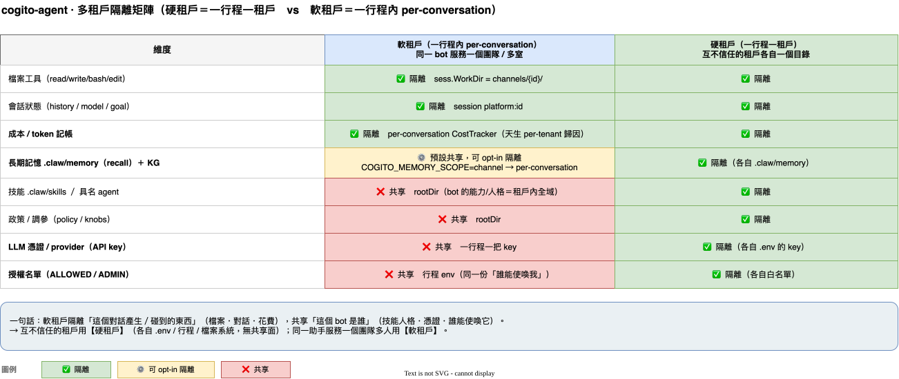

# 多租戶架構（Multi-Tenancy）

> cogito 的租戶邊界是**選擇性的、分兩層**：檔案、對話、成本歸因天生 per-conversation 隔離；
> 「大腦」（技能/記憶）與憑證/授權預設**行程級共享**。**信任模型決定你用哪一層**——
> 互不信任的租戶用「一行程一租戶」（硬隔離），同一助手服務一個團隊多人用 per-channel（軟隔離）。

這份文件把「什麼被隔離、什麼被共享、在哪一層、為什麼」講清楚，並標出刻意保留的邊界與升級路徑。
所有敘述對照 `cmd/claw/main.go`（factory）、`internal/chatbot/core.go`（channelWorkDir / 授權）、
`internal/context`（session / 記憶 / 技能）。

---

## 兩層租戶

### 硬租戶 ＝ 一行程一租戶（process-per-tenant）

「一個員工一個目錄」——`claw` 從**當前目錄**載 `.env`、工作區固定在 `<當前目錄>/workspace`。
於是一個目錄就是一個**完整隔離**的租戶：

- 自己的 IM 身分（bot token）、自己的 LLM 憑證（`ANTHROPIC_API_KEY`）
- 自己的 `.claw/`（技能 / 具名 agent / 記憶 / 政策 / 調參）
- 自己的 `COGITO_SESSION_DIR`（會話與成本）
- 自己的授權名單（`COGITO_ALLOWED_USERS` / `COGITO_ADMIN_USERS`）

**互不信任的租戶 → 用這層。** 隔離邊界是 OS 行程 + 檔案系統 + 各自的憑證，沒有任何共享面。
代價：一租戶一個常駐行程（記憶體 / bot token）。見 README「跑多個員工（多實例，零程式碼）」。

### 軟租戶 ＝ 一行程內 per-conversation（channel / DM / 論壇主題）

同一個 bot 行程服務多個對話時，每個對話（Slack 頻道、TG 群組、TG 論壇主題、DM）落在
`workspace/channels/<sanitized-id>/`，彼此隔離**一部分**。適用「同一個助手服務一個團隊 / 多個房間」，
**不適用互不信任的租戶**（見下方矩陣的「共享」列）。

---

## 隔離矩陣（軟租戶：一行程內 per-conversation）

> 原始檔：[`diagrams/tenancy-matrix.drawio`](diagrams/tenancy-matrix.drawio)（draw.io 可編輯）。下表為同內容的文字版。

| 維度 | per-conversation？ | scoped 在 | 依據 |
|---|---|---|---|
| 檔案工具（read / write / bash / edit） | ✅ **隔離** | `sess.WorkDir` = `channels/<id>/` | `RegisterCoreTools(r, sess.WorkDir, …)` |
| 背景任務（TaskManager） | ✅ 隔離 | `sess.WorkDir` | `NewTaskManager(executor, sess.WorkDir)` |
| 忙碌鎖（一次一任務） | ✅ 隔離 | per-WorkDir | `tryAcquire(workDir)` |
| 會話狀態（history / model / goal / plan） | ✅ 隔離 | session `platform:id` | `stateID` / `SessionStore` |
| **成本 / token 記帳** | ✅ **隔離** | per-conversation `CostTracker` | factory「掛該頻道專屬 CostTracker」 |
| 技能 `.claw/skills` | ❌ 共享 | `rootDir` | 「技能是共享資產、跨頻道生效」 |
| 具名 agent `.claw/agents` | ❌ 共享 | `rootDir` | 同上 |
| **長期記憶 `.claw/memory`（recall）** | ⚙️ **預設共享，可 opt-in 隔離** | `rootDir` / `sess.WorkDir` | 見下節 `COGITO_MEMORY_SCOPE` |
| 政策 / 調參（policy / knobs） | ❌ 共享 | `rootDir` | factory「配置是全 bot 共用資產」 |
| LLM 憑證 / provider | ❌ 共享 | 行程（一把 key） | factory 閉包捕獲單一 `llmProvider` |
| 授權名單（ALLOWED / ADMIN） | ❌ 共享 | 行程 env | `isAllowed` 讀 `COGITO_ALLOWED_USERS` |

**一句話**：軟租戶隔離「這個對話產生/碰到的東西」（檔案、歷史、花費），但共享「這個 bot 是誰」
（技能人格、憑證、誰能使喚它）。

---

## 為什麼這樣切（設計理由，不是疏漏）

- **技能 / 具名 agent 共享**：它們定義「這個 bot 的能力與人格」，是**租戶內全域**的資產——一個團隊的
  助手在每個房間都該是同一個助手。要不同人格 → 開不同行程（硬租戶）。
- **憑證 / 授權共享**：一個 bot 行程 ＝ 一個 IM 身分 ＝ 一把 LLM key ＝ 一份「誰能使喚我」名單。
  這正是硬租戶的邊界所在；在軟租戶內再切憑證沒有意義（同一個 bot）。
- **成本天生隔離**：即使在軟租戶內，每個對話有獨立 `CostTracker`，可**per-conversation 歸因**
  token 與 USD——這對「多租戶計費」是關鍵，且不需額外設定就有。

---

## 記憶隔離的 opt-in：`COGITO_MEMORY_SCOPE`

軟租戶最利的一個洩漏點：**長期記憶預設 per-行程共享**。同一個 bot 服務兩個不同對話時，
對話 A 蒸餾出的記憶會在對話 B 的 `recall` 冒出來——對「一個助手一個團隊」是特性（跨房間記得），
對「一個 bot 服務多個互不信任對話」是**跨租戶資訊洩漏**。

| `COGITO_MEMORY_SCOPE` | 記憶 root | 適用 |
|---|---|---|
| `global`（**預設**） | `rootDir/.claw/memory` | 一個助手服務一個團隊——跨對話共享記憶是特性 |
| `channel` | `sess.WorkDir/.claw/memory` | 一個 bot 服務多個對話、要求對話間記憶不互見 |

`channel` 模式下，記憶的**讀（recall + system prompt 索引）**與**寫（跑後反思 / `consolidate` 工具 /
`apply memory` 放行）**全部 rooted 在該對話自己的 `channels/<id>/.claw/memory`。**技能仍共享**
（`rootDir`）——只有記憶 per-conversation。驗證：`internal/context/memory_scope_test.go`
（對話 A 的記憶不出現在對話 B 的 recall；A 自己 recall 得到）。

> 這條的關鍵實作是把「記憶 root」從「技能 root」拆開——先前兩者綁在同一個 `skillMemDir`，故
> 記憶無法單獨 per-channel 而不動到技能。

---

## 硬租戶下的維運面板身分（與 tsnet 的關係）

多實例（硬租戶）下，每個租戶的 operator dashboard 是獨立行程。誰能開/操作面板的身分，
現以 `X-Forwarded-User`（可信反代注入）記入稽核（見 roadmap #5）；更硬的密碼學身分候選是
tsnet + `WhoIs`（roadmap #4，未實作）——那時每個租戶的 dashboard 是 tailnet 上獨立節點 / 獨立 ACL。
**注意**：這是「誰能操作維運面板」的身分，**不是** workload 的租戶隔離；租戶隔離就是上面兩層。

---

## 已知邊界（刻意，非待辦）

- **軟租戶不防惡意租戶**：同一行程內，一個能寫檔的具名 agent 理論上只被路徑防護（`resolveInWorkDir`）
  限制在自己的 `channels/<id>/`；記憶／技能／key 共享。要防惡意 → 硬租戶。
- **`COGITO_MEMORY_SCOPE=channel` 不追溯**：切換前累積在 `rootDir` 的記憶不會自動搬到各對話目錄。
- **KG（知識圖譜）跟隨記憶 root**：channel 模式下 KG 也 per-conversation（同一個記憶 root）；
  跨對話的多跳關係因此也不互見——與記憶記錄一致。
- **授權仍 per-行程**：軟租戶內無 per-conversation 白名單。要 per-租戶授權 → 硬租戶（各自 `.env`）。

---

## 具名 agent 的 per-agent 記憶（讀半邊已實作）

與租戶隔離同構的另一軸：每個具名 agent（`.claw/agents/<name>.md`）可有自己的記憶目錄
`.claw/agents/<name>/memory/`（記錄格式同 `.claw/memory`）。`spawn_subagent(agent_type=<name>)`
時，該 agent 的記憶記錄會**注入子 agent 的 role prompt**——具名專員跨 spawn「記得」過往同類任務的
沉澱，且**不污染主 context、不與其他 agent 互見**（scout 的記憶不會出現在 planner 的 context）。

- **已實作（讀）**：載入 + 注入。記憶靠**手寫**填（像技能）。實作 `internal/context`（`NewMemoryLoaderAt`
  / `LoadForInjection`）＋ `internal/tools/subagent.go`（spawn 注入）。測試 `subagent_memory_test.go`。
- **未實作（寫）**：子 agent 跑完自動反思 → per-agent 提案記憶 → 治理放行。這是淨新增的子 agent
  反思點 + per-agent 治理面，規模較大且原 gate 在「orchestrator 實跑確認每次從零開始真的痛」——
  等該痛確認再上。目前全量注入（per-agent 記憶預期少量；多到脹 context 時改索引＋給子 agent recall）。
